import { FactBox, MathBlock, BenefitsTable, PostPublishNote } from '@blog'
import SineWaveSimulator from './SineWaveSimulator'
import TDDSimulation from './TDDSimulation'
import FDDSimulation from './FDDSimulation'

<PostPublishNote date="2021-10-11T20:00Z">

Since publishing this article, I've done further research which explores why different frequency bands perform differently in real-world
applications.

I would highly recommend reading the new article after this one in order to ensure you leave with the full range of knowledge applicable.

[Read the new article](/blog/2021/10/11/speed-differences-high-low-frequencies)

</PostPublishNote>

<TableOfContents {...props} />

LTE (4G) functions on a wide range of frequencies. These frequency ranges are called bands, and are standardised across the world.

These frequencies range from as low as 410 MHz up to almost 6 GHz in some cases, but not all of these frequency bands are supported on every
device.

## How does frequency link to speed?

In theory, it doesn't really, and it's a common misconception of how radio frequency (RF) systems work. Frequency on its own makes no difference
to the speeds you can achieve on LTE.

The frequency is a **carrier frequency**, meaning that its only role is to carry the LTE signal. This signal is encoded into a channel with a set
width (such as 10 MHz or 20 MHz).

In fact, the data carried on that signal can be moved to any other frequency as long as the available bandwidth is the same. In the example
animation below, we can copy a 20 MHz bandwidth signal from 2100 MHz to 800 MHz without any loss in data.

The only way that frequency and speed are linked is in their ability to penetrate surfaces.

### Penetrating power

In general, lower frequency (longer wavelength) waves can pass more easily through dense substances. For example, you can hear bass notes from
music through walls more easily than you can hear vocals.

<FactBox title="Bear with me...">

This might look pretty complex, but stick with the explanation. It's simpler than it looks, I promise!

</FactBox>

As a wave, such as radio waves, travel through materials, they lose some of their energy. While they travel through the air, energy loss is
minimal, allowing waves to travel for kilometres in ideal circumstances. When they travel through denser materials, such as brick or concrete,
they lose more energy.

<SineWaveSimulator />

## Duplex modes

**Duplex** refers to the ability for a communication channel to transmit and receive data. LTE can be either **full duplex** (meaning that
transmitting and receiving can happen simulataneously), or **half duplex** (meaning that transmitting and receiving can happen, but not at the
same time).

Both LTE-TDD and LTE-FDD share the vast majority of their core infrastructure, allowing chipset and modem manufacturers to more easily support
both modes with one single chip.

### Time-division Duplex (TDD)

Time-division Duplex works by using one single frequency, and by switching between uploading and downloading over time. The proportion of time
spent uploading or downloading can be changed on-the-fly to account for longer periods spent mainly downloading or uploading.

There needs to be a small period in between the transition from uplink to downlink and vice versa. This is called the **guard period** or guard
interval. This is used to ensure one device's transmission is fully received before the other begins to transmit. This period must get longer as
the devices grow further apart, resulting in significant throughput loss over long distances.

LTE-TDD is mainly used at higher frequencies, covering bands between 1850 MHz and 3800 MHz. The LTE-TDD spectrum allocation is normally cheaper
than LTE-FDD and also has less traffic.

#### Simulation

<TDDSimulation />

### Frequency-division Duplex (FDD)

Frequency-division duplex works by using two different frequencies, where each is dedicated to either upload or download only.

For FDD to work, networks need to use paired frequencies. For example, 800 MHz Band 20 uses an offset spacing of $-41\text\{ MHz}$, meaning that
downlink frequencies are found $-41\text\{ MHz}$ from uplink frequencies (e.g. if uplink is at 800 MHz, then downlink is at 769 MHz). As this
spectrum must be paired and purchased in these sets, it's often much more expensive to set up and run than LTE-TDD due to licensing costs.

As the frequencies for uplink and downlink are locked for each network, it is hard for them to dynamically change their speeds. When using TDD,
networks can dynamically set the amount of time that is spent either uploading or downloading, but with FDD the relationship is fixed to the
spectrum allocations owned.

#### Simulation

<FDDSimulation />

### Benefits of LTE-TDD and LTE-FDD

Both TDD and FDD have their own benefits, which is why most networks choose to deploy both across their network.

In the UK, for example, all 4 major networks (EE, Vodafone, Three and Virgin Media O2) use a combination of TDD and FDD as part of their network
coverage. The vast majority of their networks use FDD bands, such as B1, B3, B7 and B20, however some networks are beginning to roll out
TDD-based spectrum.

Vodafone are starting to roll out bands 32 and 38 within larger cities for extra coverage and throughput. As B7 leaves a large 120 MHz gap
between 2570 MHz and 2620 MHz for duplex spacing, band 38 allows for TDD communication within this gap, providing extra throughput while not
affecting the existing B7.

<FactBox title="Why is there such a large duplex spacing?">

Many bands use extremely large duplex spacing (frequency split) to prevent interference and 'leakage'. If the spacing was too small, then uplink
and downlink could interfere with each other, increasing error rates for devices connected to the LTE network.

While they could be positioned much closer together, this would put a greater cost on the network operator to use more complex technology to
prevent noise and interference between the two channels.

</FactBox>

Here's a table comparing the benefits of each technology:

<BenefitsTable columnHeadings={['LTE-TDD', 'LTE-FDD']}>
  {() => [
    [
      {
        text: 'Allows for dynamically adjusting downlink slots',
        description: ['For high demand, extra downlink slots can be added, increasing speeds at the cost of uplink throughput'],
      },
      { text: 'Less expensive', description: ['No need to buy expensive diplexer', 'Less spectrum needs to be licensed'] },
    ],
    [
      {
        text: 'Overall higher throughput',
        description: [
          'Transmitting and receiving can happen at once, achieving max throughput of 2x TDD at same bandwidth',
          'In TDD, the guard period (dead air time) increases with distance, reducing efficiency',
        ],
      },
      { text: 'Lower latency', description: ['No need to wait for the next period to send data like TDD'] },
      { text: 'Less complex', description: ['No complex time sychronisation requirements'] },
    ],
  ]}
</BenefitsTable>

While FDD is the most beneficial to consumers, the higher cost makes it unfavourable for networks looking to increase their network capacity in
densely populated areas, which is why LTE-TDD is more common in new deployments in cities and large towns across the globe.

FDD is still preferred by networks choosing to deploy in new areas or to generally increase speeds and coverage as it can handle more devices
connected to a single band due to it using two channels of equal bandwidth rather than one single channel.

## List of all LTE bands

There are many different LTE bands, but not all bands are supported on all devices.

Chipset manufacturers often charge extra for every band manufacturers would like to support with the phone. To cut costs, most phones only choose
to support around 20 bands, but this is usually enough to cover all commercial bands in the majority of countries.

  <table>
    <thead>
      <tr>
        <th>Band number</th>
        <th>Duplex mode</th>
        <th>Frequency</th>
        <th>Uplink</th>
        <th>Downlink</th>
        <th>Duplex spacing</th>
        <th>Channel bandwidths</th>
        <th>Notes</th>
      </tr>
    </thead>
    <tbody>
      <tr>
        <td>1</td>
        <td>FDD</td>
        <td>2100</td>
        <td>1920 – 1980</td>
        <td>2110 – 2170</td>
        <td>190</td>
        <td>5, 10, 15, 20</td>
        <td></td>
      </tr>
      <tr>
        <td>2</td>
        <td>FDD</td>
        <td>1900</td>
        <td>1850 – 1910</td>
        <td>1930 – 1990</td>
        <td>80</td>
        <td>1.4, 3, 5, 10, 15, 20</td>
        <td></td>
      </tr>
      <tr>
        <td>3</td>
        <td>FDD</td>
        <td>1800</td>
        <td>1710 – 1785</td>
        <td>1805 – 1880</td>
        <td>95</td>
        <td>1.4, 3, 5, 10, 15, 20</td>
        <td></td>
      </tr>
      <tr>
        <td>4</td>
        <td>FDD</td>
        <td>1700</td>
        <td>1710 – 1755</td>
        <td>2110 – 2155</td>
        <td>400</td>
        <td>1.4, 3, 5, 10, 15, 20</td>
        <td></td>
      </tr>
      <tr>
        <td>5</td>
        <td>FDD</td>
        <td>850</td>
        <td>824 – 849</td>
        <td>869 – 894</td>
        <td>45</td>
        <td>1.4, 3, 5, 10</td>
        <td></td>
      </tr>
      <tr>
        <td>7</td>
        <td>FDD</td>
        <td>2600</td>
        <td>2500 – 2570</td>
        <td>2620 – 2690</td>
        <td>120</td>
        <td>5, 10, 15, 20</td>
        <td></td>
      </tr>
      <tr>
        <td>8</td>
        <td>FDD</td>
        <td>900</td>
        <td>880 – 915</td>
        <td>925 – 960</td>
        <td>45</td>
        <td>1.4, 3, 5, 10</td>
        <td></td>
      </tr>
      <tr>
        <td>11</td>
        <td>FDD</td>
        <td>1500</td>
        <td>1427.9 – 1447.9</td>
        <td>1475.9 – 1495.9</td>
        <td>48</td>
        <td>5, 10</td>
        <td></td>
      </tr>
      <tr>
        <td>12</td>
        <td>FDD</td>
        <td>700</td>
        <td>699 – 716</td>
        <td>729 – 746</td>
        <td>30</td>
        <td>1.4, 3, 5, 10</td>
        <td></td>
      </tr>
      <tr>
        <td>13</td>
        <td>FDD</td>
        <td>700</td>
        <td>777 – 787</td>
        <td>746 – 756</td>
        <td>−31</td>
        <td>5, 10</td>
        <td></td>
      </tr>
      <tr>
        <td>14</td>
        <td>FDD</td>
        <td>700</td>
        <td>788 – 798</td>
        <td>758 – 768</td>
        <td>−30</td>
        <td>5, 10</td>
        <td></td>
      </tr>
      <tr>
        <td>17</td>
        <td>FDD</td>
        <td>700</td>
        <td>704 – 716</td>
        <td>734 – 746</td>
        <td>30</td>
        <td>5, 10</td>
        <td></td>
      </tr>
      <tr>
        <td>18</td>
        <td>FDD</td>
        <td>850</td>
        <td>815 – 830</td>
        <td>860 – 875</td>
        <td>45</td>
        <td>5, 10, 15</td>
        <td></td>
      </tr>
      <tr>
        <td>19</td>
        <td>FDD</td>
        <td>850</td>
        <td>830 – 845</td>
        <td>875 – 890</td>
        <td>45</td>
        <td>5, 10, 15</td>
        <td></td>
      </tr>
      <tr>
        <td>20</td>
        <td>FDD</td>
        <td>800</td>
        <td>832 – 862</td>
        <td>791 – 821</td>
        <td>−41</td>
        <td>5, 10, 15, 20</td>
        <td></td>
      </tr>
      <tr>
        <td>21</td>
        <td>FDD</td>
        <td>1500</td>
        <td>1447.9 – 1462.9</td>
        <td>1495.9 – 1510.9</td>
        <td>48</td>
        <td>5, 10, 15</td>
        <td></td>
      </tr>
      <tr>
        <td>24</td>
        <td>FDD</td>
        <td>1600</td>
        <td>1626.5 – 1660.5</td>
        <td>1525 – 1559</td>
        <td>−101.5</td>
        <td>5, 10</td>
        <td></td>
      </tr>
      <tr>
        <td>25</td>
        <td>FDD</td>
        <td>1900</td>
        <td>1850 – 1915</td>
        <td>1930 – 1995</td>
        <td>80</td>
        <td>1.4, 3, 5, 10, 15, 20</td>
        <td></td>
      </tr>
      <tr>
        <td>26</td>
        <td>FDD</td>
        <td>850</td>
        <td>814 – 849</td>
        <td>859 – 894</td>
        <td>45</td>
        <td>1.4, 3, 5, 10, 15</td>
        <td></td>
      </tr>
      <tr>
        <td>28</td>
        <td>FDD</td>
        <td>700</td>
        <td>703 – 748</td>
        <td>758 – 803</td>
        <td>55</td>
        <td>3, 5, 10, 15, 20</td>
        <td></td>
      </tr>
      <tr>
        <td>29</td>
        <td>SDL</td>
        <td>700</td>
        <td>N/A</td>
        <td>717 – 728</td>
        <td>N/A</td>
        <td>3, 5, 10</td>
        <td></td>
      </tr>
      <tr>
        <td>30</td>
        <td>FDD</td>
        <td>2300</td>
        <td>2305 – 2315</td>
        <td>2350 – 2360</td>
        <td>45</td>
        <td>5, 10</td>
        <td></td>
      </tr>
      <tr>
        <td>31</td>
        <td>FDD</td>
        <td>450</td>
        <td>452.5 – 457.5</td>
        <td>462.5 – 467.5</td>
        <td>10</td>
        <td>1.4, 3, 5</td>
        <td></td>
      </tr>
      <tr>
        <td>32</td>
        <td>SDL</td>
        <td>1500</td>
        <td>N/A</td>
        <td>1452 – 1496</td>
        <td>N/A</td>
        <td>5, 10, 15, 20</td>
        <td></td>
      </tr>
      <tr>
        <td>34</td>
        <td>TDD</td>
        <td>2000</td>
        <td colspan="2">2010 – 2025</td>
        <td>N/A</td>
        <td>5, 10, 15</td>
        <td></td>
      </tr>
      <tr>
        <td>35</td>
        <td>TDD</td>
        <td>1900</td>
        <td colspan="2">1850 – 1910</td>
        <td>N/A</td>
        <td>1.4, 3, 5, 10, 15, 20</td>
        <td>PCS Uplink Block</td>
      </tr>
      <tr>
        <td>36</td>
        <td>TDD</td>
        <td>1900</td>
        <td colspan="2">1930 – 1990</td>
        <td>N/A</td>
        <td>1.4, 3, 5, 10, 15, 20</td>
        <td>PCS Downlink Block</td>
      </tr>
      <tr>
        <td>37</td>
        <td>TDD</td>
        <td>1900</td>
        <td colspan="2">1910 – 1930</td>
        <td>N/A</td>
        <td>5, 10, 15, 20</td>
        <td>PCS Duplex Spacing</td>
      </tr>
      <tr>
        <td>38</td>
        <td>TDD</td>
        <td>2600</td>
        <td colspan="2">2570 – 2620</td>
        <td>N/A</td>
        <td>5, 10, 15, 20</td>
        <td>IMT-E Duplex Spacing</td>
      </tr>
      <tr>
        <td>39</td>
        <td>TDD</td>
        <td>1900</td>
        <td colspan="2">1880 – 1920</td>
        <td>N/A</td>
        <td>5, 10, 15, 20</td>
        <td></td>
      </tr>
      <tr>
        <td>40</td>
        <td>TDD</td>
        <td>2300</td>
        <td colspan="2">2300 – 2400</td>
        <td>N/A</td>
        <td>5, 10, 15, 20</td>
        <td></td>
      </tr>
      <tr>
        <td>41</td>
        <td>TDD</td>
        <td>2500</td>
        <td colspan="2">2496 – 2690</td>
        <td>N/A</td>
        <td>5, 10, 15, 20</td>
        <td></td>
      </tr>
      <tr>
        <td>42</td>
        <td>TDD</td>
        <td>3500</td>
        <td colspan="2">3400 – 3600</td>
        <td>N/A</td>
        <td>5, 10, 15, 20</td>
        <td></td>
      </tr>
      <tr>
        <td>43</td>
        <td>TDD</td>
        <td>3700</td>
        <td colspan="2">3600 – 3800</td>
        <td>N/A</td>
        <td>5, 10, 15, 20</td>
        <td></td>
      </tr>
      <tr>
        <td>44</td>
        <td>TDD</td>
        <td>700</td>
        <td colspan="2">703 – 803</td>
        <td>N/A</td>
        <td>3, 5, 10, 15, 20</td>
        <td>No band allocations</td>
      </tr>
      <tr>
        <td>45</td>
        <td>TDD</td>
        <td>1500</td>
        <td colspan="2">1447 – 1467</td>
        <td>N/A</td>
        <td>5, 10, 15, 20</td>
        <td></td>
      </tr>
      <tr>
        <td>46</td>
        <td>TDD</td>
        <td>5200</td>
        <td colspan="2">5150 – 5925</td>
        <td>N/A</td>
        <td>10, 20</td>
        <td>
          <a href="https://en.wikipedia.org/wiki/LTE_in_unlicensed_spectrum#License_Assisted_Access_(LAA)">License Assisted Access (LAA)</a>
        </td>
      </tr>
      <tr>
        <td>47</td>
        <td>TDD</td>
        <td>5900</td>
        <td colspan="2">5855 – 5925</td>
        <td>N/A</td>
        <td>10, 20</td>
        <td>
          <a href="https://en.wikipedia.org/wiki/Vehicle-to-everything#3GPP_(C-V2X)">V2X</a>
        </td>
      </tr>
      <tr>
        <td>48</td>
        <td>TDD</td>
        <td>3500</td>
        <td colspan="2">3550 – 3700</td>
        <td>N/A</td>
        <td>5, 10, 15, 20</td>
        <td></td>
      </tr>
      <tr>
        <td>49</td>
        <td>TDD</td>
        <td>3500</td>
        <td colspan="2">3550 – 3700</td>
        <td>N/A</td>
        <td>10, 20</td>
        <td></td>
      </tr>
      <tr>
        <td>50</td>
        <td>TDD</td>
        <td>1500</td>
        <td colspan="2">1432 – 1517</td>
        <td>N/A</td>
        <td>3, 5, 10, 15, 20</td>
        <td></td>
      </tr>
      <tr>
        <td>51</td>
        <td>TDD</td>
        <td>1500</td>
        <td colspan="2">1427 – 1432</td>
        <td>N/A</td>
        <td>3, 5</td>
        <td></td>
      </tr>
      <tr>
        <td>52</td>
        <td>TDD</td>
        <td>3300</td>
        <td colspan="2">3300 – 3400</td>
        <td>N/A</td>
        <td>5, 10, 15, 20</td>
        <td></td>
      </tr>
      <tr>
        <td>53</td>
        <td>TDD</td>
        <td>2500</td>
        <td colspan="2">2483.5 – 2495</td>
        <td>N/A</td>
        <td>1.4, 3, 5, 10</td>
        <td></td>
      </tr>
      <tr>
        <td>65</td>
        <td>FDD</td>
        <td>2100</td>
        <td>1920 – 2010</td>
        <td>2110 – 2200</td>
        <td>190</td>
        <td>1.4, 3, 5, 10, 15, 20</td>
        <td></td>
      </tr>
      <tr>
        <td>66</td>
        <td>FDD</td>
        <td>1700</td>
        <td>1710 – 1780</td>
        <td>2110 – 2200</td>
        <td>400</td>
        <td>1.4, 3, 5, 10, 15, 20</td>
        <td></td>
      </tr>
      <tr>
        <td>67</td>
        <td>SDL</td>
        <td>700</td>
        <td>N/A</td>
        <td>738 – 758</td>
        <td>N/A</td>
        <td>5, 10, 15, 20</td>
        <td></td>
      </tr>
      <tr>
        <td>68</td>
        <td>FDD</td>
        <td>700</td>
        <td>698 – 728</td>
        <td>753 – 783</td>
        <td>55</td>
        <td>5, 10, 15</td>
        <td></td>
      </tr>
      <tr>
        <td>69</td>
        <td>SDL</td>
        <td>2600</td>
        <td>N/A</td>
        <td>2570 – 2620</td>
        <td>N/A</td>
        <td>5, 10, 15, 20</td>
        <td>IMT-E Duplex Spacing</td>
      </tr>
      <tr>
        <td>70</td>
        <td>FDD</td>
        <td>1700</td>
        <td>1695 – 1710</td>
        <td>1995 – 2020</td>
        <td>295 – 300</td>
        <td>5, 10, 15, 20</td>
        <td></td>
      </tr>
      <tr>
        <td>71</td>
        <td>FDD</td>
        <td>600</td>
        <td>663 – 698</td>
        <td>617 – 652</td>
        <td>−46</td>
        <td>5, 10, 15, 20</td>
        <td></td>
      </tr>
      <tr>
        <td>72</td>
        <td>FDD</td>
        <td>450</td>
        <td>451 – 456</td>
        <td>461 – 466</td>
        <td>10</td>
        <td>1.4, 3, 5</td>
        <td></td>
      </tr>
      <tr>
        <td>73</td>
        <td>FDD</td>
        <td>450</td>
        <td>450 – 455</td>
        <td>460 – 465</td>
        <td>10</td>
        <td>1.4, 3, 5</td>
        <td></td>
      </tr>
      <tr>
        <td>74</td>
        <td>FDD</td>
        <td>1500</td>
        <td>1427 – 1470</td>
        <td>1475 – 1518</td>
        <td>48</td>
        <td>1.4, 3, 5, 10, 15, 20</td>
        <td></td>
      </tr>
      <tr>
        <td>75</td>
        <td>SDL</td>
        <td>1500</td>
        <td>N/A</td>
        <td>1432 – 1517</td>
        <td>N/A</td>
        <td>5, 10, 15, 20</td>
        <td></td>
      </tr>
      <tr>
        <td>76</td>
        <td>SDL</td>
        <td>1500</td>
        <td>N/A</td>
        <td>1427 – 1432</td>
        <td>N/A</td>
        <td>5</td>
        <td></td>
      </tr>
      <tr>
        <td>85</td>
        <td>FDD</td>
        <td>700</td>
        <td>698 – 716</td>
        <td>728 – 746</td>
        <td>30</td>
        <td>5, 10</td>
        <td></td>
      </tr>
      <tr>
        <td>87</td>
        <td>FDD</td>
        <td>410</td>
        <td>410 – 415</td>
        <td>420 – 425</td>
        <td>10</td>
        <td>1.4, 3, 5</td>
        <td></td>
      </tr>
      <tr>
        <td>88</td>
        <td>FDD</td>
        <td>410</td>
        <td>412 – 417</td>
        <td>422 – 427</td>
        <td>10</td>
        <td>1.4, 3, 5</td>
        <td></td>
      </tr>
    </tbody>
    <tfoot>
      <tr>
        <td colSpan={8}>
          We can't guarantee the accuracy of this data. <a href="https://en.wikipedia.org/wiki/LTE_frequency_bands#Frequency_bands">Use Wikipedia</a> as
          the source of truth instead.
        </td>
      </tr>
    </tfoot>

  </table>

