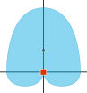
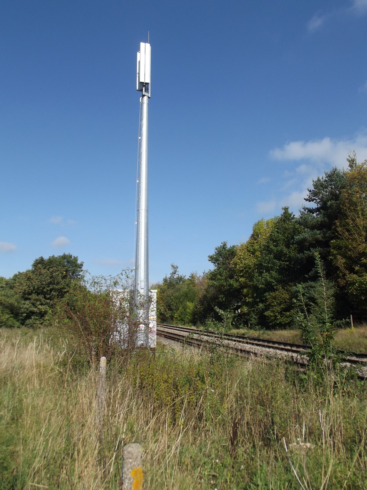
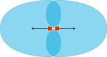

import { FactBox } from '@blog'

<TableOfContents {...props} />

Modern cell sites cover a surprisingly large area, often providing signal to 2 km² or more. However, an individual mast panel is not capable of
providing this coverage on its own. Instead, multiple panels are combined together to form a single cell site which broadcasts from a central
location in multiple different directions. This is sectorisation.

## Radiation patterns

The **radiation pattern** is the shape of the radio wave emitted by a single panel.

For most modern 4G LTE panels, this covers a large area in front of the panel, along with a small area behind the panel on either side.

In the top-down diagram below, the red square is the panel, and the blue shaded area shows the radiation pattern. The panel is facing the
direction of the arrow.

You'll notice that this **single panel** can only effectively cover one direction from its position.

## Combining cells

Because a single panel can only effectively provide coverage in one direction, they are not used very often. Instead, multiple panels are
combined to provide coverage in multiple directions.

<FactBox title="What's a cell?">

Along with combining panels to provide coverage in multiple directions, they can also be combined to provide connectivity on multiple
frequencies.

This is very common in urban areas, where one panel may be used for more long-distance connectivity (such as on Band 20 or 800 MHz) and another
may be used to provide higher speed connectivity (such as on Band 40).

When this is done, the combined panels are referred to as a **cell**.

</FactBox>

The coverage area provided by each of these cells is called a **sector**.

### Bi-sector (2 panels)

**Bi-sector configurations** consist of two panels, usually opposite one another. These are commonly used to provide coverage along long,
straight paths, such as motorways and railway tracks.

In the UK, these are most prevalent along railway tracks, providing [GSM-R coverage](https://en.wikipedia.org/wiki/GSM-R) to trains on, as
railway lines are generally very straight.

#### Bi-sector radiation pattern

Once again, the red squares are the panels, and the blue shaded area is the coverage of the radiation pattern. The panels are each facing the
direction of their respective arrows.

### Tri-sector (3 panels)

By far, the most prevalent configuration is a **tri-sector configuration**.

This involves combining 3 or more cells to create a 3-leafed flower radiation pattern, as seen below. This is the most effective way to provide
coverage to a large area, as the radiation patterns can be [tessellated](https://en.wikipedia.org/wiki/Tessellation) (fit together) more easily
with the least overlap, while also reducing the total number of sites required.

#### Tri-sector radiation pattern

Once again, the red squares are the panels, and the blue shaded area is the coverage of the radiation pattern. The panels are each facing the
direction of their respective arrows.

#### Tessellation

The main benefit of tri-sector configurations is that they can be arranged so that one site can cover another's "blind spot".

In the example below, multiple tri-sector sites are used to provide overlapping coverage to a very large area. To cover this area, only 7 sites
are needed, each with 3 panels, totalling 21 panels overall.

With more time and effort, this could be optimised even further. It's extremely likely that mobile network operators have automated systems and
algorithms that can calculate the ideal locations for new cell sites.

## Capacity management

Sectorisation is not only used for increasing overall coverage, but also for capacity management. Each sector can only handle a certain number of
user devices at one time before the network becomes congested. Congestion results in slower speeds, higher latency and (in some extreme cases)
devices being dropped off the network entirely.

Increasing the number of sectors can help to manage this. If one sector can handle 400 devices, then a 6-sector setup can manage 2400 devices,
compared to a tri-sector configuration which could only handle 1200.

## The future of sectorisation

Some networks are beginning to implement 6-sector configurations in more congested areas. While this also results in less congestion on the
network, it can also result in an increase of overall coverage.

Furthermore, each panel can transmit with a "tighter" field of coverage (closer to 60 degrees instead of 120 degrees), meaning that the signal is
focused forwards than left or right, resulting in a greater overall coverage area.

---

### Attribution

- GSM-R Mast image taken by user ["Dacs"](https://en.wikipedia.org/wiki/User:Dacs) on Wikipedia.
  [Source](https://en.wikipedia.org/wiki/File:GSM-R_Base_Station_Abergavenny.jpg)
