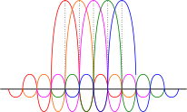

import { FactBox, MathBlock } from '@blog'

<TableOfContents {...props} />

Orthogonal Frequency Division Multiplexing (more simply referred to as OFDM) allows multiple signals to overlap significantly while producing
little to no interference. It supercedes Frequency Division Multiplexing (FDM), where signals do not overlap, and require a spacer (guard band)
between them.

## Subcarriers

In 5G NR and 4G LTE, the individual signals that are multiplexed using OFDM are called subcarriers. These subcarriers act as individual channels
which are used to transmit and receive data.

Each subcarrier is assigned a specific frequency within the LTE or 5G NR band. In LTE, subcarriers are always spaced 15 KHz apart. In 5G, the
spacing is flexible (either 15 kHz, 30 kHz, 60 kHz, 120 kHz, 240 kHz, 480 kHz) to allow for a vast range of use cases.

## Resource blocks (RBs)

> ⚠️ This section is written specifically about 4G LTE. These facts may not be completely accurate for 5G. Please perform your own research.

The number of subcarriers depends on the number of resource blocks (RBs) available, which itself depends upon the bandwidth available.

**Every RB contains 12 subcarriers.** This is fixed and never changes.

| Bandwidth | RBs | Subcarriers |
| :-------: | :-: | :---------: |
|  1.4 MHz  |  6  |     72      |
|   3 MHz   | 15  |     180     |
|   5 MHz   | 25  |     375     |
|  10 MHz   | 50  |     600     |
|  15 MHz   | 75  |     975     |
|  20 MHz   | 100 |    1200     |

### Symbols

In LTE, each subcarrier can carry 15 thousand symbols per second (15 ksps).

A symbol is a unit of data consisting of one or more bits. The number of bits depends on how the symbol is encoded.

| Encoding Method |  Bits per symbol  |
| :-------------: | :---------------: |
|  QPSK (4 QAM)   | 2 bits per symbol |
|     16 QAM      | 4 bits per symbol |
|     64 QAM      | 6 bits per symbol |
|     256 QAM     | 8 bits per symbol |

<figure role="group">
  <MathBlock
    title="Max throughput calculation"
    math="\text{max throughput (bps)} = 15000 \times \text{subcarrier count} \times \text{bits per symbol}"
  />
  <MathBlock
    color="neutral"
    title="Example"
    footer="20 MHz (1200 subcarriers) at 256 QAM"
    math="1200 \times 15000 \times 8 = 144\space\text{Mbps}"
  />
</figure>

It's extremely important to note that **you will never see speeds this high in real-world usage**. Not only are your sharing access to the
resource blocks with other users, but these calculations do not include any overhead that is present for coding and control purposes, etc.

<FactBox title="What's QAM?">

QAM stands for Quadrature Amplitude Modulation. It is a technique that uses a combination of two carrier signals on the same frequency, offset
from each other by 90 degrees, to encode multiple bits per symbol.

Essentially, this allows you to fit up to 8 bits (256 QAM) into each symbol (a piece of encoded data) instead of just 1 or 2.

A future article will go into greater depth on QAM.

</FactBox>

## OFDM in practice

As we mentioned earlier, OFDM is a technique that allows multiple signals to overlap significantly while producing little to no interference.

In 4G LTE and 5G NR, these signals are subcarriers inside each resource block.

Each signal is spaced apart so that the peak of any one signal lines up perfectly with the spectrum nulls of all other signals. You can see this
by following the dotted lines in the diagram above from the peak down. This reduces the amount of interference from other subcarriers.

### 4G LTE

In 4G LTE, OFDM is only used for downlink from phone masts (eNodeB's) to your device (UE's). It is not used for uplink from the UE to the eNodeB.

#### Uplink

For uplink, another frequency division method is used called Single Carrier Frequency-Division Multi Access (SC-FDMA). This is where the UE
accesses the full bandwidth of a whole resource block for one or more symbol periods (the time it takes to send a symbol -- approx. 66.7
microseconds for LTE). This allows multiple devices to share access to the uplink frequencies, which being more power-efficient than OFDM.

<FactBox title="Why not OFDM for uplink?">

When the 4G LTE specification was being created, power-efficiency was at the forefront of people's minds when designing the uplink. Most user
equipment (UE), such as phones, are battery-operated, so a trade-off was needed between speed and efficiency.

The performance difference between SC-FDMA and OFDM is very small, however SC-FDMA is much more efficient, so is used in UE modems instead.

</FactBox>

### 5G NR

In 5G NR, OFDM is used for both uplink and downlink.

Modern modems can transmit data much more efficiently then they could when 4G LTE was being finalised, meaning that OFDM can be used in both
directions in modern devices.

Its specific form of OFDM is called CP-OFDM (cyclical prefix OFDM), which is what allows for the use of differing subcarrier spacing.
