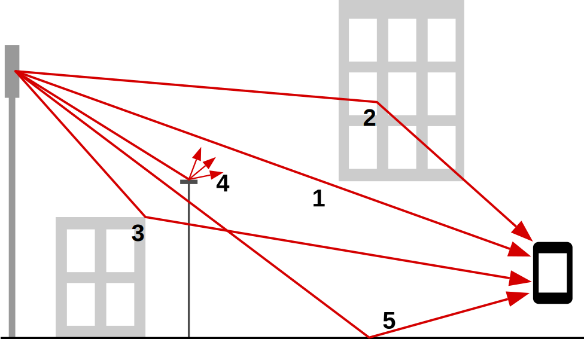
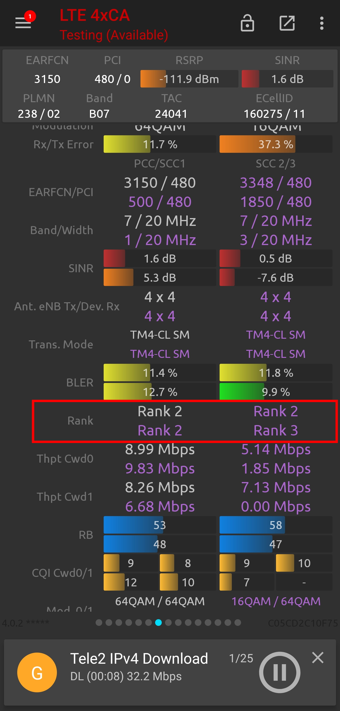

import { FactBox } from '@blog'

<TableOfContents {...props} />

# Introduction

MIMO (multiple input, multiple output) is a way of increasing the throughput of a data connection by broadcasting and receiving multiple data
streams simultaneously.

These streams allow for the theoretical total data throughput on a single carrier frequency to be doubled, tripled, quadrupled, or even more. In
reality though, due to interference, the throughput won't be exactly doubled, tripled, quadrupled, etc.

The vast majority of LTE sites in developed countries are equipped with 2x2 MIMO capability.

# Multipath propagation

Each of the data streams are transmitted from different antennae inside the LTE passive panels. The streams from each antenna take slightly
different paths to the user device, as they're treated differently by the environment; each stream is refracted, reflected and scattered slightly
differently. While often this would negatively impact performance due to interference, the idea behind MIMO in LTE relies solely on this
philsophy, called **multipath propagation**.

These slightly different conditions allow your device and the receiving antenna at the base station to more easily pick apart the signal streams
from one another (there is a higher signal-to-noise ratio/SINR), allowing the device to achieve higher 'ranks'.

There are five ways that multipath propagation commonly occurs (labelled above):

1. **Direct** - the signal travels directly from the transmitting antenna to the receiving antenna
2. **Reflected** - the signal is reflected off an object towards the receiving antenna
3. **Refracted** - the signal path is slightly changed by an object towards the receiving antenna
4. **Scattered** - the signal hits a rounded object and spreads into multiple directions
5. **Ground-reflected** - the signal is reflected off the ground towards the receiving antenna

<FactBox title="Read all about it!">

Keysight Technologies have a fantastic blog post about the quest for LTE MIMO, going into further detail about Massive MIMO, and more technical
aspects of the concept.

[Read Keysight's blog post](https://blogs.keysight.com/blogs/inds.entry.html/2018/09/30/finding_mimo_howd-sf32.html)

</FactBox>

# Ranks

Ranks are the way a device describes its current Tx/Rx stream capability. Rank 1 means that the device only has a high SINR on one of the
possible streams from the eNodeB. Rank 2 means there's a high SINR on two streams, rank 3 meaning three streams, and so on.

Your phone will continuously report its rank indicator to the eNodeB at intervals decided by the eNodeB during the LTE attach procedure. If your
phone reports rank 4, then the eNodeB knows that it can transmit on all four streams, and your phone will be able to receive all four of these.

If you use software such as Network Signal Guru (NSG), it's always important to remember to look at the rank and not just look at the antenna
Tx/Rx info it states (1x1, 2x2, 4x4), as the rank is the figure which actually matters in terms of performance improvements.

<figure>

<figcaption>

Screenshot of Network Signal Guru, showing different carrier frequencies operating on different ranks, while all showing a 4x4 antenna setup.

</figcaption>
</figure>

# How can I tell if a site has MIMO?

The easiest way is to check with a phone on that network. Using NSG, you can see what the Tx/Rx antenna setup is, as shown in the screenshot
above.

If you don't have a capable device or SIM, you can also look at the site's feeders. Feeders won't always be accurate -- they may be disconnected
from the radios or other sie equipment -- but they can help to inform you of what is possible on the site. Often, for MIMO, you will see tags on
the panel feeders labelled `A`, `B`, `C`, and so on, or `1A`, `1B`, `2A`, `2B`, etc.

You can see an example of this in the image below, with eight feeders labelled as `3/L23-A` through to `3/L23-H`, indicating an 8T8R
configuration on 2300 MHz LTE.

<figure>

<figcaption>

Feeders to a 24-port Commscope passive antenna panel, set up with an 8x8 antenna setup on 2300 MHz LTE (Band 40).

</figcaption>
</figure>
