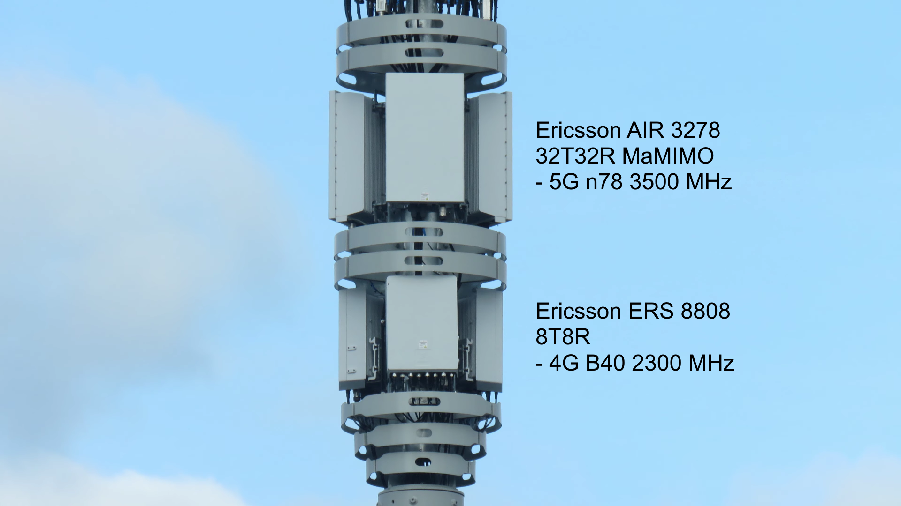
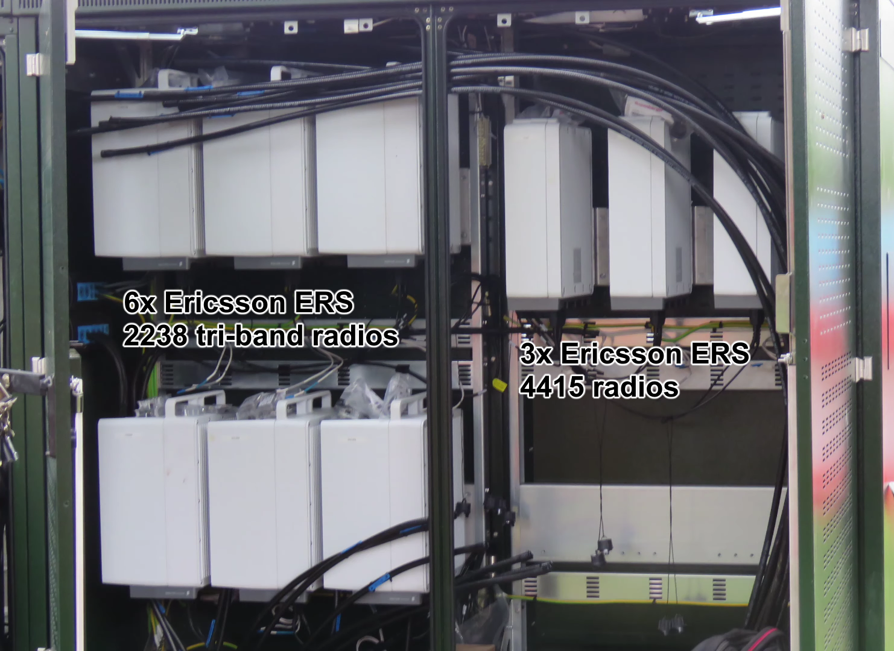
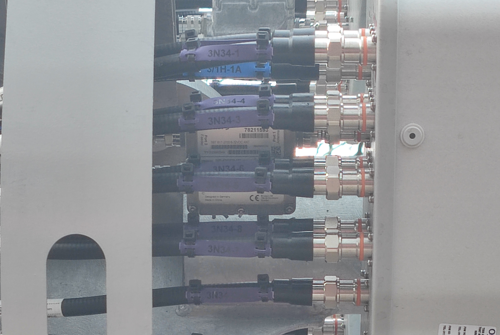

import { TableOfContents, FactBox } from '@blog'

<TableOfContents {...props} />

<FactBox title="Note">

Click on any of the images in this article to view them in their full-size glory.

</FactBox>

# A brief history

O2 (PLMN <code>234/10</code>) is the largest mobile network operator in the United Kingdom in terms of customers. Including its MVNOs, O2's
customer base totals a whopping 36.2 million customers in a country of just 67 million, meaning they have a market share of 54%.
([Source](https://news.o2.co.uk/press-release/o2-continues-customer-growth-and-profitability-as-it-supports-uk-through-pandemic))

In the past, O2 has struggled in terms of capacity. Many parts of the UK which used to be more rural have grown over time, resulting in O2 sites
which used to be more than capable of providing decent performance to customers within their zone suffering from lower performance as network
load increases each year. This is extremely prevalent with their main 800 MHz LTE deployments across rural and suburban communities.

# Introduction to Orion

In 2021, O2 launched its "Beacon 3" network upgrade project, including its brand new, flagship Orion monopoles.

<FactBox>

"Beacon" was the codename for a series of joint upgrade plans made between O2 and Vodafone to provide LTE to the whole of the UK.

Beacon 3 is the first Beacon project to include installation of unilateral sites as opposed to the multi-operator radio access network (MORAN)
sites we typically see with Cornerstone Networks.

</FactBox>

Orion monopoles manage to cram a multitude of 4G bands, along with n28 and n78 5G and their standard 2G/3G all into **one street cabinet and one
monopole**, often replacing what used to be basic 4G/3G/2G monopoles and several street cabinets.

O2 have begun favouring these new deployments because of their simplicity. A pole swap can be performed in just one day, consisting of
contractors installing the feeders in the new cabinet, and an HIAB truck arriving with the new monopole, lifting and dropping it into place, and
then taking the old one away to be stripped for parts.

# Planning applications

For mobile networks to install new street infrastructure, they do not need to apply for planning permission. Instead, they must submit a notice
of **prior notification**. This is a notice of intent, basically saying "I want to do something. Tell me if I can't.".

The local planning authority has **56 days to object to the plans, or approve them**. No response after 56 days is classed as an approval. The
big kick against conspiracy theorists is that **LPAs may only reject proposed development due to its siting or appearance**.

The compact nature of Orion monopole sites mean that councils are probably more likely to approve them compared to monopoles from other
operators, which may clutter public areas with various street furniture. This is especially apparent if you compare Orion sites to similar Phase
7 sites from Mobile Broadband Network Limited, which provide all radio access technologies (2G/3G/4G/5G) for Three and EE.

<figure>

<figcaption>

An MBNL Phase 7 site with 7 different cabinets.

</figcaption>
</figure>

## Exemptions

Exemptions exist from submitting prior notification plans, aimed to make minor changes easier for network operators. While they are meant for
swapping out equipment when it fails or for adding new microwave link dishes to sites, O2 have now been seen using these powers for performing
full-on Orion site swaps in some areas.

One of my local monopole sites in Burgess Hill, for example, has recently been swapped from a Beacon 2 site to a new dual operator Orion with no
prior notice submitted. This was possible due to one exemption:

> ...prior approval does not apply to ground-based masts which when altered or replaced would not exceed the greater of the height of the
> existing mast and 20m above ground level.

Since my old local monopole was 20m in height, and so was the new Orion monopole, **the site could be swapped out without any form of approval
required**.

# Orion equipment

Orion installations differ between vendor zones. Most Orion sites we've seen have been O2 unilaterals using Ericsson equipment. We've seen some
Cornerstone shared MORAN (multiple operator radio access network) sites (where O2 and Vodafone are both located on the monopole), though.

## Ericsson vendor

The Ericsson Orion monopoles were first noted by [Peter Clarke and Jake (Undersc0re)](https://www.youtube.com/watch?v=ou_CGjbQ8uc) in Cardiff.

These deployments consisted of Huawei passive atennas for broadcasting 2G, 3G, 4G on all frequencies and 5G 700 MHz. They also had Ericsson AIR
3278 32T32R massive MIMO antenna panels for 5G 3500 MHz n78, and Ericsson ERS 8808 8TRx RRUs for 2300 MHz B40 LTE.

The site's passive antennas are driven by three Ericsson ERS 4415 radios for 2100 MHz 4G LTE, and six Ericsson ERS 2238 tri-band radios for 700
MHz 5G NR, 800/900 MHz 4G LTE and 900 MHz 2G/3G.

## Nokia vendor

[My site](https://www.google.com/maps/place/50%C2%B058'00.2%22N+0%C2%B008'13.7%22W/@50.9667335,-0.1376914,19z) was one of the first we'd seen in
the wild using Nokia equipment. It was also a dual-operator site, with O2 and Vodafone both broadcasting from it.

Unlike the [previous Ericsson sites seen by Peter and Jake](https://www.youtube.com/watch?v=ou_CGjbQ8uc), this site doesn't appear to be equipped
for a massive MIMO deployment, instead preferring 8T8R for n78 5G.

On the top of the monopole are three
[Commscope 24-port RRZZT4S4-65B-R6 antennas](https://www.commscope.com/product-type/antennas/base-station-antennas-equipment/base-station-antennas/itemrrzzt4s4-65b-r6/),
each fully loaded with feeder cables. This is different from the Huawei passive antennas we had previously seen in Ericsson zones.

We also find the remote radio heads at the top of the pole. This site appears to be utilising three Nokia AirScale 8T8R AZNC RRUs for LTE 2300
MHz, with three Nokia AirScale 8T8R AZQJ RRHs for NR 3500 MHz likely to be installed at a later date.

The street furniture used was a single Yorkshire cabinet, while the previous three cabinets (one for each operator, plus one for power) were
removed as part of the upgrade on day four.

<FactBox title="It's worth knowing...">

The use of non-Huawei antennas in this Orion build **is not** related to the UK's ban on Huawei equipment in new 5G deployments, as that ban only
applies to active equipment, while previous Orion builds have used Ericsson active antennas for 5G.

</FactBox>

This particular Orion site appears to be configured for:

- 5G
  - 8T8R 3500 MHz NR (n78) at 40 MHz
  - 2T2R (possibly 4R) 700 MHz NR (n28) at 10 MHz, paired
- 4G
  - 4T4R 2100 MHz LTE (B1) at 10 MHz, paired
  - 2T2R 900 MHz LTE (B8) at 10 MHz, paired
  - 2T2R 800 MHz LTE (B20) at 10 MHz, paired
  - 8T8R 2300 MHz LTE (B40) with 2x20 MHz TDD carriers
- and standard 2G/3G 900 MHz

**n78 5G is not yet active on the site** as the remote radio units are missing from the monopole, as you can see below, and the 3500 MHz feeders
remain disconnected next to it. This RRU is set to be installed on 30 Jan 2022, according to information from
[one.network](https://one.network/).

### Beam tilting

Beam tilting is a way to control the distance which a site can transmit at a given effective power level. It works by changing the angle at which
beams are transmitted at from the antenna. In the past, this used to be done by physically moving the antenna elements inside the panel with
motors, but this is now more commonly done through phase control.

Phase control tilts beams by altering the time at which different antenna elements receive RF signals. This tilts the signal beam in a specific
direction.

<FactBox>

Beam tilting is particularly useful for controlling which sites are dominant in different areas, usually those with the most carrier frequencies
or MIMO capabilities or greatest backhaul capacity, in order to not overload smaller sites and to reduce interference from neighbouring cells.

This beam tilting optimisation is often referred to as **coverage-capacity optimisation**.

</FactBox>

On this Nokia Orion site, beam tilting is performed through the use of Kathrein FlexRETs, powered by
[Kathrein 78211593 smart bias tees](https://marketplace.shields-e.com/Product/Details/78211593), seen in between the feeders in the image below.

# Attribution

Huge thank yous go to Peter Clarke, Derico, Allie, Jake (Undersc0re) and many others for help in piecing together sections of this article and
proofreading it.

A big thanks also goes to the team at [ICS GROUP](https://www.linkedin.com/company/intelligent-communications-solutions-limited/) who installed
the new Orion site in Burgess Hill for letting me take photos and videos while they were working throughout the day.
