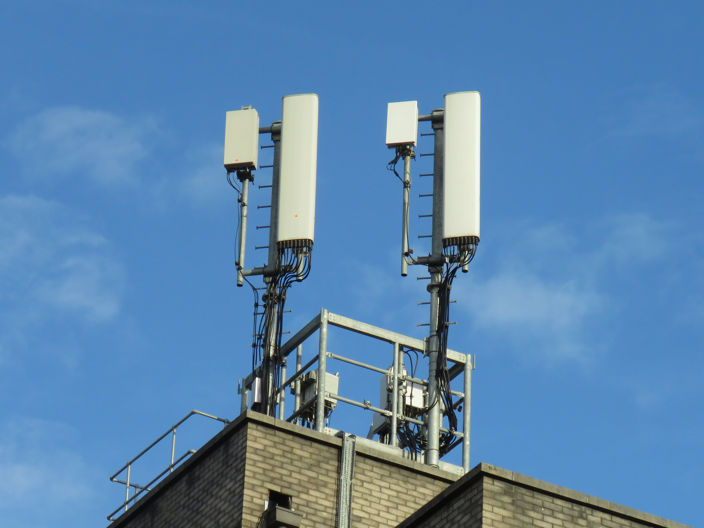
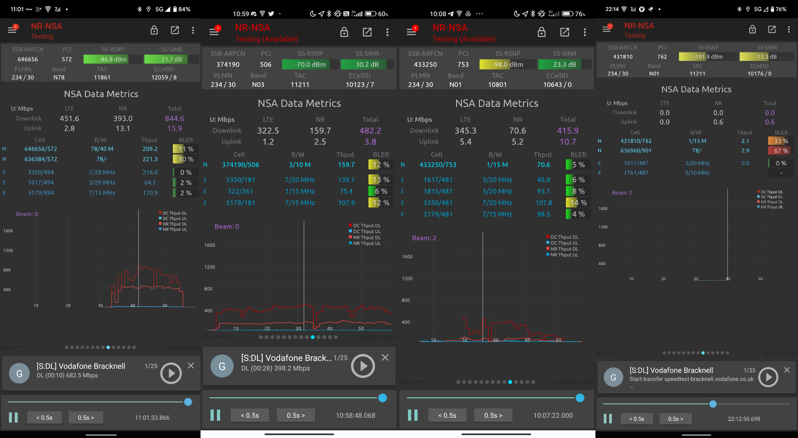

import { SpectrumMap } from '@blog'
import Band78 from 'mobile-spectrum-data/GB/78'

<TableOfContents {...props} />

EE's innovation in RAN has found it at the bleeding edge of new 5G deployments in the UK, being the first operator to deploy 5G NR carrier
aggregation in a relatively widespread manner across many parts of the UK capital, London.

# 5G in the UK

In the UK, all four mobile network operators operate only 5G NSA networks for general consumer access. All operators have varying spectrum
allocations within dedicated 5G-only spectrum (n78 3500 MHz), with Three having access to the most spectrum (140 MHz), with O2 and Vodafone tied
for second (90 MHz) and EE trailing behind in forth (80 MHz).

  <SpectrumMap caption="UK n78 spectrum allocation" data={Band78} />

No UK operator has allocation in a single contiguous block of spectrum, meaning that the race for fastest peak performance has led to a battle
for who can deploy 5G NR CA first. EE, with the lowest spectrum allocation, has been the perfect breeding ground for such technology, hence it
makes sense that they have been the first commercial network to provide public access to it.

# EE's spectrum holding

As of April 2022, EE own a vast amount of mobile spectrum in the UK:

- **15 MHz** paired of usable low band
  - 5+5 MHz in 800 MHz
  - 10+10 MHz in 700 MHz
- **115 MHz** paired of mid band
  - 45+45 MHz in 1800 MHz
  - 20+20 MHz in 2100 MHz
  - 50+50 MHz in 2300 MHz
- **80 MHz** of high band
  - two 40 MHz allocations straddling Three's 100 MHz allocation

These large allocations allow EE to trial new radio technologies more easily by reallocating small chunks of this spectrum as and when they need.
EE's new NR trial sites are a great example of these, managing to deploy almost all of their available spectrum, with a significant amount of
spectrum which would normally be used for 4G LTE refarmed for 5G NR purposes.

# EE's 5G NR trial sites

A select number of sites, primarily in London but now expanding into other areas of the UK, have recently been upgraded to feature increased NR
spectrum compared to before.

Sites which were originally only utilising a single 40 MHz block of n78 spectrum for NR now transmit two separate 40 MHz carriers, fully
utilising EE's available spectrum, as well as 10 MHz of n28, 15 MHz DSS n1 and 10 MHz of n3. This totals a whopping five separate NR layers,
which is rather impressive.

Best of all, however, is that all of these sites and layers support NR carrier aggregation, meaning that, provided you have a supported device,
you could end up with 80 MHz of NR on EE, NR permitting.

<figure>

<figcaption>

An EE five layer 5G NR testbed site atop City and Islington College near Holloway Road, London (eNB 10180).

</figcaption>
</figure>

## Field testing

When out and about near these sites, we've found rather impressive performance on each of these NR carriers.

<figure className="narrow">

| NR layer | Peak downlink throughput |
| :------: | :----------------------: |
|   n28    |         ~50 Mbps         |
|  n1 DSS  |        ~100 Mbps         |
|    n1    |        ~125 Mbps         |
|    n3    |        ~175 Mbps         |
|  n78C1   |        ~350 Mbps         |
|  n78C2   |        ~350 Mbps         |

</figure>

While none of these numbers on their own are particularly impressive, at least when compared to Three UK's 100 MHz NR \>1 Gbps capability, EE's
aim is likely not for pure peak performance, but rather reaching a wider number of customers with lower band NR offerings, such as n1 and n3,
while still providing 5G-like performance.

## NR CA

Carrier aggregation has long been a thing for 4G LTE networking, and even back to 3G UMTS, but we're only just seeing it for 5G NR in the UK.

All five NR layers on EE's trial sites are capable of NR CA with one another, but the most common aggregation combinations are n78-n78 or
n28-n78. On the sites, the network will strongly favour n78-n78 wherever possible, with n28-n78 only being used when n78 uplink is not available
due to bad RF conditions.

Recently, I have caught glimpse of n1-n78 aggregation, which does prove that EE's Ericsson trial setup is capable of such NR CA combinations, but
very rarely.

<figure>

<figcaption>

Network Signal Guru field testing showing various NR aggregation combinations and throughput values for carriers.

</figcaption>
</figure>

# Why so much NR?

At the moment, few devices will end up utilising the full array of available NR layers, with most devices sticking to one or both n78 carriers,
or one of the other carriers as you approach the cell edge.

The main reason for trialling such deployments is to prepare for the deployment of 5G SA (standalone). In this 5G mode, all traffic is carried
over NR, as opposed to NSA which uses the existing 4G core infrastructure, with 5G NR only as an additional data layer.

Having a known working configuration for NR with a large number of carriers will make EE's job much simpler for when they choose to enable 5G SA,
where more devices will be able to take advantage of NR aggregation, and the coverage of 5G layers will have a bigger impact on users than
current 5G NSA.

# Conclusion

Compared to other networks' offerings, EE seems to be the most exciting in terms of 5G NR, and with the biggest and most obvious public
preparation for 5G standalone.

At the moment, EE's 5G performance is primarily limited by device capabilities rather than the network, with a large number of 5G devices not
supporting NR CA, and those that do having limited aggregation combinations, meaning that often EE's 5 or more LTE carriers perform on-par or
better than these NR CA trial sites.
