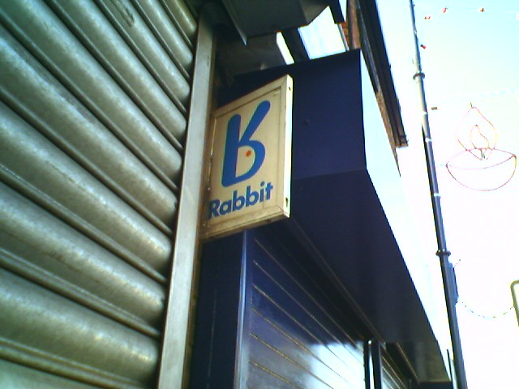
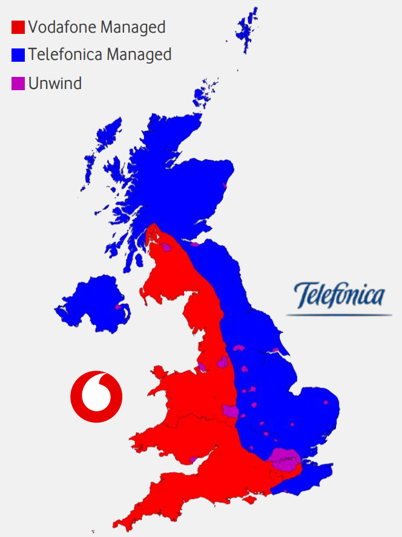
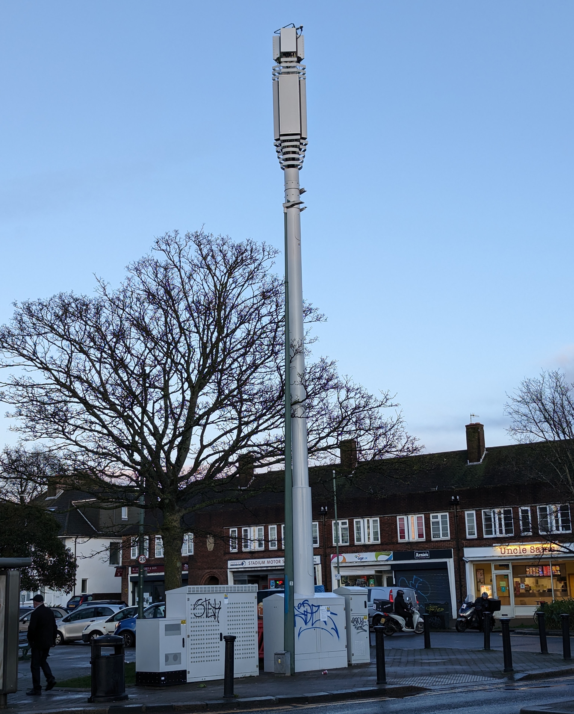
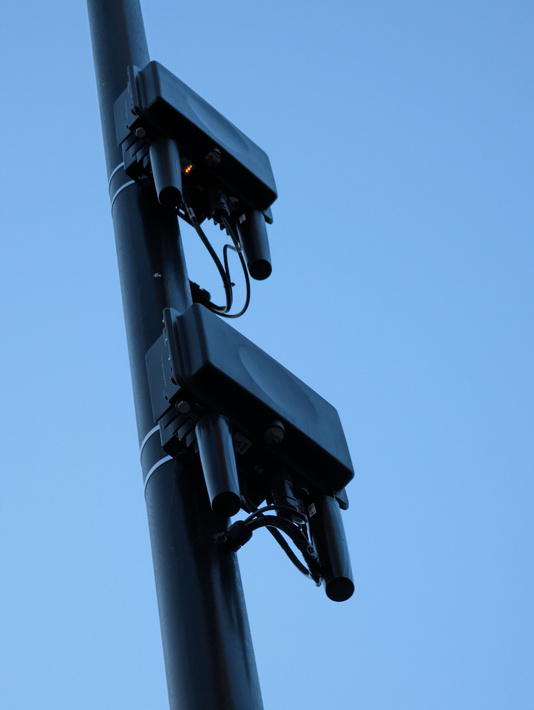

import AllSpectrumMaps from '@components/MobileNetworking/AllSpectrumMaps'
import SpectrumTotaller from '@components/MobileNetworking/SpectrumTotaller'
import Accordion from '@components/Design/Accordion'
import MinorAlert from '@components/Design/MinorAlert'
import MergerAllBands from './spectrum/VHUK-merger/base'
import MergerAllBandsPostCma, { changesOnly as MergerAllBandsPostCmaChangesOnly } from './spectrum/VHUK-merger-adjusted/base'
import CurrentUKSpectrum from './spectrum/GB'

<TableOfContents {...props} />

# Background

Three UK is owned by a Hong Kong-based conglomerate named CK Hutchison, which also owns Three in various other countries, including Ireland,
Austria, Denmark, Italy (WindTre), and more. Hutchison are deeply ingrained within the history of UK mobile networks, with Three UK being their
third UK mobile network since they entered the market.

Vodafone UK is the third largest mobile network in the UK, as of 2022, and is owned by Vodafone Group, a British multinational telecommunications
company headquartered in Newbury, England. Vodafone Group is the second largest mobile network operator in the world, operating networks in 21
countries and partners in a further 47.

## History of Three

### Rabbit

<figure>

<figcaption>

Rabbit signage outside a store in Ashton Under Lyne in 2005. Credit: [Jonathandavis](https://en.wikipedia.org/wiki/User:Jonathandavis) licensed
under [CC BY-SA 3.0](https://creativecommons.org/licenses/by-sa/3.0/deed.en).

</figcaption>
</figure>

CK Hutchison launched their first UK mobile network in May 1992 named Rabbit. Rabbit offered CT2 (often seen as the precursor to modern DECT)
coverage within 100m of their transmitters, and, at their peak, operated 12,000 base stations and provided services to 10,000 subscribers.

Rabbit ceased operations only 20 months after launch. This was primarily due to the imminent launch of newer digital GSM on competitor networks,
such as Vodafone and BT Cellnet, who also offered an incoming calls service. Hutchison lost close to $183 million from the failure of Rabbit, but
this wouldn't make them think twice about another entry into the UK market.

### Orange

<figure>

<figcaption>

Remnants of Orange can still be seen today across the UK, including this billboard at Newbury Racecourse station (2023).

</figcaption>
</figure>

While Rabbit was being launched, in July 1991, Hutchison acquired a controlling stake in a business named Microtel, who obtained a license to run
a GSM-based mobile network in the UK. Hutchison renamed this business to Orange Personal Communication Services (PCS) in March 1994.

Services on Orange launched exactly a month later in April 1994 on 1800 MHz, contracting an advertising agency to create a now iconic slogan for
those living through the era, "The future's bright, the future's Orange." Orange made their intial public offering and floated on the London
stock exchange in April 1996, and became the youngest company to enter the FTSE100 in June 1996, with a valuation of £2.4 billion.

Orange PCS was eventually purchased in October 1999 by German conglomerate Mannesmann for $33 billion, which caused Vodafone to make a hostile
takeover bid for the German company. 4 months later, in February 2000, Vodafone Group announced it had completed an acquisition of Mannesmann for
$128 billion, but was forced to divest Orange due to EU competition regulations with regards to mobile licenses. In May 2000, it was announced
that France Télécom (France's now-privatised telecommunications provider) would purchase Orange PCS for $37 billion, completing the sale in
August of that year.

Orange UK later merged with T-Mobile UK in 2010 to form a new company named Everything Everywhere, which is still in operation today as simply
"EE". The Orange brand was phased out completely by mid-2015, and EE was purchased by BT Group in 2016 following unconditional approval by the
UK's Competition and Markets Authority.

### Three

<figure>

<figcaption>

A Three store in Banbury (2008). Credit: [Stratford490](https://commons.wikimedia.org/wiki/User:Stratford490) licensed under
[CC BY-SA 3.0](https://creativecommons.org/licenses/by-sa/3.0/deed.en).

</figcaption>
</figure>

Three UK is Hutchison's third play at a UK mobile network, so far. It launched on 3 March 2003 (3/3/03), offering a fully 3G-based network
without any GSM functionality unlike the other networks at the time. Three was the first UK network to meet the coverage obligation within its
network license of 80% of the population, doing so by 9 December 2004, with some networks following behind, and
[Vodafone failing to meet their 90% coverage obligation entirely](https://www.theguardian.com/business/2013/nov/07/vodafone-fails-minimum-3g-mobile-internet-coverage).

At the start of its operations, Three partnered with O2 to provide national roaming on O2's GSM service in order to offer coverage parity outside
of their own 3G areas. Three replaced O2's services with Orange in May 2006, who provided GSM fallback into 2015 when Three opted to switch off
national roaming entirely.

In 2007, Three UK and T-Mobile UK announced a joint venture named MBNL to consolidate their network infrastructure build and upgrades programme,
with the goal of reducing costs and improving coverage. Later, this expanded to include Orange UK after it merged with T-Mobile to form EE. MBNL
started to wind down from April 2023, with Three and EE handling upgrades and maintenance unilaterally into the future.

Three pioneered the concept of the EU's "roam like at home" policies, with customers, until 2009, able to roam on Three's other networks in
Europe at no additional cost compared to their domestic pricing. This restarted in 2013, with further countries without Three networks being
added in coming years, before the re-introduction of roaming fees from 2021 due to the UK's exit from the EU.

Three's merger talks with Vodafone are not Hutchison's first attempt at a merger with another network, first announcing in March 2015 that a deal
had been struck with O2 to acquire its UK-based operations for a total of £10.25 billion. This purchase was blocked by the EU Commission on the
grounds it would significantly affect competition within the UK market.

# Merger with Vodafone

Three's latest merger talks are with Vodafone, for which rumours first began circulating around May 2022. These talks were potentially sparked by
Liberty Global and Telefónica UK's merger of their respective businesses (Virgin Media and O2) in 2021, but had likely been considered prior to
this.

The pairing of Vodafone and Three may seem odd at first, considering the two businesses' differences in operations. Vodafone UK is a
long-standing, traditional brand which many young people may interpret as "old", meanwhile Three is the youth-centric brand that offers fantastic
value for money data across its own brand and its in-house MVNO, SMARTY, exacerbated by Three removing fair usage caps from their unlimited plans
entirely in 2022.

In actual fact, this combination works very well. Vodafone has both a strong brand awareness, as well as a huge infrastructure network of both
mobile base stations, and its own dark fibre network across the UK. Vodafone also has a strong presence in the enterprise market, with Three UK
having a strong presence in the consumer market. With the two networks being the two smallest in the UK, it's unsurprising why they would like to
join forces to compete against the larger BT/EE and Virgin Media O2.

## Infrastructure

### Cornerstone and Beacon

<figure>

<figcaption>

O2 and Vodafone's management split within Cornerstone.

</figcaption>
</figure>

Vodafone has a large infrastructure network of mobile base stations across the UK, operated in partnership with O2 under the joint venture
Cornerstone. Cornerstone was formed in 2009, and is responsible for the maintenance and upgrades of both Vodafone and O2's mobile networks, with
the two networks sharing the same infrastructure. The two networks share repsonsibility of the infrastructure by splitting the country into zones
under projects named Beacon 1 and Beacon 2.

Cornerstone and Beacon means that Vodafone has reliable coverage arrangements across the entire UK, which could extend to Three in the case of a
merger. Some speculation suggests the Cornerstone agreement could be terminated in the case of a merger, but this would also place O2 at such a
disadvantage across huge swaths of the UK so it appears very unlikely.

That being said, many major UK cities (including London, Birmingham, Brighton, Cardiff, Manchester, and Liverpool) are already being "unwound" in
another project named Beacon 3. In these areas, shared infrastructure is being separated into two networks, with Vodafone and O2 each taking
responsibility for their own infrastructure and, hence, network coverage.

### Three's rapid network expansion

<figure>

<figcaption>

A Three UK Phase 8 streetworks site and surrounding cabinets.

</figcaption>
</figure>

In the past few years, Three have invested heavily in expanding their 5G coverage through new streetworks sites. The unilateral streetworks
programme consists of slimline monopoles across towns, cities and the countryside that are capable of hosting Three's full range of technologies.

Three's rapid deployment programme is a huge success, with the networking having over 4,250 live 5G sites as of May 2023, up from 2,200 in 2022.
This rollout is shown by Three taking the crown for fastest median and peak 5G speeds in the UK
[according to Ookla](https://www.ookla.com/articles/three-5g-performance-uk-ireland-austria-q2-2023). Three have also been
[upgrading backhaul to their sites to 10 Gbps](https://www.threemediacentre.co.uk/content/three-uk-network-and-it-update-3/) to maximise 4G and
5G performance. We have seen single-user [peaks of up to 2.1 Gbps on Three 5G](https://twitter.com/davwheat_/status/1649699563530334208) which is
near impossible to achieve on other UK networks.

| Network     | Median 5G speed |
| ----------- | :-------------: |
| Three UK    |   275.83 Mbps   |
| Vodafone UK |   138.90 Mbps   |
| EE          |   111.14 Mbps   |
| O2 UK       |   70.63 Mbps    |

Three's 5G upgrade works are a slice of a full network transformation. Site upgrades are typically phased, with the company usually upgrading
physical infrastructure (radios, antennas, etc.) before upgrading the backhaul to the site. While some argue that both should be upgraded
simultaneously, the separation of these two tasks allows for upgrades overall to be performed faster as delays in one process does not hold up
the other. Furthermore, in the case of some sites, upgrading backhaul without upgrading the physical infrastructure is another approach Three
have taken in order to facilitate future site upgrades while minimising the need for additional works.

Additionally, Three
[partnered with SSE Enterprise Telecoms](https://www.commsupdate.com/articles/2018/07/10/sse-enterprise-telecoms-unbundling-177-bt-exchanges-announces-deal-with-three-uk/)
to unbundle[\[1\]](#note-1) 177 BT exchanges to facilitate backhaul connectivity between sites and the core network.
Three and SSE claim that these works will futureproof the network and provide the ability to deliver a network with up to 100 Gbps speeds in the
future. It was also noted that these 177 exchanges are the "first of several potential unbundling phases", so we may see more exchanges unbundled
in the future.

### Post-merger infrastructure

A merger between Vodafone and Three would result in significant overlap of infrastructure from the two networks' current coverage portfolio. A
big question is what steps would be taken to consolidate the two networks into one, and what would happen to the infrastructure that is no longer
needed.

Although the mobile tower market in 2023 is very different to that of 2010, we are likely to see a similar process take place as that which
happened at EE when T-Mobile and Orange merged. The network will attempt to identify sites with coverage not provided by any other sites and
those that provide capacity that is hard to supplement with other masts, keep those and then decommission the others slowly. In EE's case the
decision-making process was complicated by the need to offer Three 'free' access to some sites as part of the competition mitigation allowing the
deal to proceed and by Three choosing to 'buy in' to some sites. Sticking with the tried and tested EE playbook, it is likely that the sites will
be grouped into clusters and prioritised for rebuild to a single design standard.

Media reports have suggested that the details of this outline plan have been a sticking point in the merger negotiations, however the merger
comes at a time when all networks are attempting to monetise their existing grids and increase the tenancy ratio (the number of networks using
each mast). Grid monetisation would mean that a nimbler approach, choosing the best of both major UK grids, may be the ideal way forward. The
contracts underpinning tower monetisation, typically 15&ndash;20-year deals, may be a stumbling block in a quick decommission programme to
realise the merger benefits, however the precise details are naturally commercially sensitive.

## Spectrum

<aside style={{ marginBottom: 16 }}>
<MinorAlert color="neutralGrey" coloredBackground>

For spectrum totals in this section, I have excluded holdings within B67 supplemental downlink and n77 C-band not already included in n78.

B67 is not supported by any consumer devices and Three's n77 license (3925&ndash;4009&nbsp;MHz) does not permit usage for mobile coverage.

</MinorAlert>
</aside>

For a mobile network, spectrum is critical. It is the radio waves that carry the data and voice traffic between the mobile phone and the network.
Essentially, the more spectrum a network has, the higher peak speeds it can offer to customers, and the greater the capacity of the network.

When the merger between T-Mobile and Orange began, it became clear that the combined network would have too much spectrum. This was reported by
[The Register](https://www.theregister.com/2009/09/10/t_orange_spectrum/) before it became clear the merge-co didn't want to give up any of its
valuable spectrum
([ISPReview](https://www.ispreview.co.uk/story/2009/11/24/t-mobile-and-orange-uk-refuse-to-share-mobile-broadband-spectrum.html)).

An [investigation](https://ec.europa.eu/competition/publications/cpn/2010_2_6.pdf) by the EU into the merger found that the merged company would
hold almost 48% of the UK's mobile spectrum and "[the] merger could thus possibly have led the parties to have the only full-speed national LTE
network in the short to medium term".

At the end, the merged company opted to divest a quarter (15&nbsp;MHz paired) of their 1800&nbsp;MHz spectrum, as well as other concessions, to
allow the merger to pass through competition regulators.

### Current spectrum outlook

We have a [full page on UK spectrum allocations](/gb/spectrum), but we can summarise total allocations per-network at the time of publishing.

<figure className="narrow" style={{ overflowX: 'auto', marginBottom: 16 }}>
  <figcaption>Current spectrum allocations per-operator, excluding n77 and B67</figcaption>

  <SpectrumTotaller
    hideMmwave
    bandsData={CurrentUKSpectrum}
    countryCode="GB"
    style={{ marginTop: '0 !important', marginBottom: '0 !important' }}
    omitOperators={['ESN']}
    omitBandNames={['n77', 'B67']}
  />
</figure>

#### Sub-6 5G

Three is best-placed for 5G with 140&nbsp;MHz n78 currently deployed with 84&nbsp;MHz in the n77 band, although this is not currently suitable
for 5G use due to license restrictions. Vodafone have the second-highest n78 allocation at 90&nbsp;MHz, split into two blocks of 40 and
50&nbsp;MHz.

A merger between the two with no intervention would result in significant Sub-6 5G spectrum holdings, maxing out a 2CA n78 configuration with
30&nbsp;MHz left over spare.

#### Low band

Low band is critical to rural and indoor coverage. Currently, O2 has the greatest amount of low band spectrum, with holdings in 700, 800 and 900
MHz totalling 37.4&nbsp;MHz, and EE trails just behind with 35&nbsp;MHz in 700 and 800 MHz.

Three has the least low band spectrum out of all UK networks, which becomes clear when looking at their rural performance across the country.
Since 700 MHz was only auctioned in 2021, Three's primary low band deployment for almost a decade has been a painful 5&nbsp;MHz of B20 LTE, with
many locations being served by only B20 LTE coming from shared sites with EE.

<figure>

<figcaption>
Cellmapper allows us to see crowdsourced data about sites for most mobile networks globally. [This area](https://www.cellmapper.net/map?MCC=234&MNC=20&type=LTE&latitude=50.94982855494183&longitude=0.21040556755178433&zoom=11.941842671632223&showTowers=true&showIcons=false&showTowerLabels=true&clusterEnabled=false&tilesEnabled=true&showOrphans=false&showNoFrequencyOnly=false&showFrequencyOnly=true&showBandwidthOnly=false&DateFilterType=Last&showHex=false&bands=20&showVerifiedOnly=false&showUnverifiedOnly=false&showLTECAOnly=false&showENDCOnly=false&showBand=20&showSectorColours=true&mapType=roadmap&darkMode=false&imperialUnits=false) of the map (East Sussex) shows how much of Three's rural coverage consists of only 5&nbsp;MHz B20 LTE.
</figcaption>
</figure>

### Post-merger spectrum outlook

A merger of Vodafone and Three would result in a monopoly on spectrum assets, with the combined entity holding 496.7&nbsp;MHz of spectrum, which
is over two times the amount of spectrum held by the next network, EE, at 210&nbsp;MHz (plus 20&nbsp;MHz B67 SDL).

The joint-venture would hold a total of 42.4&nbsp;MHz of paired low band spectrum which, combined with the significant pool of physical network
infrastructure provided through both Cornerstone, MBNL, and Three's own portfolio, would offer a significant rural coverage and performance
upgrade on the current networks.

Furthermore, considering the current push for C-band 5G deployments, the merged business would hold two contiguous chunks of n78 spectrum,
totalling 230&nbsp;MHz, on top of Three's 84&nbsp;MHz n77 allocation not currently permitted for mobile coverage.

Using [Robyn (Undersc0re)'s 5G throughput calculator](https://tools.pedroc.co.uk/5g-speed/), we could see that, even excluding LTE which would be
used in 5G NSA, 230&nbsp;MHz n78 spectrum could facilitate peak theoretical downlink speeds of over 4&nbsp;Gbps. Who needs mmWave if you can have
anti-competitive spectrum holdings?

#### Full spectrum allocations

Provided the CMA and Ofcom do not opt to enforce a spectrum trade between the merged entity and the other UK networks, the combined joint-venture
would have the following spectrum holdings:

<figure className="narrow" style={{ overflowX: 'auto', marginBottom: 16 }}>
  <figcaption>Spectrum allocations per-operator assuming no spectrum sales, excluding n77 and B67</figcaption>

  <SpectrumTotaller
    hideMmwave
    bandsData={MergerAllBands}
    countryCode="GB"
    style={{ marginTop: '0 !important', marginBottom: '0 !important' }}
    customOperators={{ VHUK: ['Vodafone Hutchison UK'] }}
    omitOperators={['ESN']}
    omitBandNames={['n77', 'B67']}
  />
</figure>

<Accordion heading="View unadjusted spectrum holding diagrams" style={{ marginBottom: 24 }}>
  <AllSpectrumMaps
    locationName=""
    countryCode="GB"
    bandsData={MergerAllBands}
    dense
    dontWrapWithPageSection
    hideSectionHeading
    hideHeadings
    hideDetails
    hideLicenseInfo
    hideHighlighter
    customColors={{ '#c42b1e': ['VHUK', 'Vodafone Hutchison UK'] }}
    customCaption={(_, bandNames) => `Band${bandNames.length !== 1 ? 's' : ''} ${bandNames.join(', ')}`}
  />
</Accordion>

#### Being realistic

In reality, it's extremely unlikely that a single network would be permitted to hold a monopoly on spectrum to this extent.

It's almost certain that the CMA would require the merged entity to divest some of its spectrum holdings, particularly within the 800, 1500,
1800/2100 and 3500&nbsp;MHz bands. It's hard to say exactly what will happen, as that depends on other operators' long-term plans and strategies
and how they opt to lobby the CMA, alongside the CMA's decisions.

In my opinion, 1800/2100 is the most difficult decision. On one hand, VHUK having almost 30&nbsp;MHz of spectrum within the 2100&nbsp;MHz band is
a big advantage, so they may be required to sell some of this spectrum. On the other hand, O2's investment in a dense 1800&nbsp;MHz small cell
network across major urban areas, but expecially within London. The ability to expand this from 5&nbsp;MHz to 10&nbsp;MHz would significantly
improve O2's network capacity.

<figure>

<figcaption>
Two O2 Nokia small cells on Abingdon Street near the Palace of Westminster, London.
</figcaption>
</figure>

My predictions for any spectrum sales are:

- 5&nbsp; MHz block of B20 (800&nbsp;MHz) transferred to EE
  - This results in an even 10&nbsp;MHz per operator, and is an obvious no-brainer for the UK market
  - The loss of B20 capacity per customer is made up for by the gain of 10 MHz B28 through Three's holdings
- 20&nbsp;MHz block of B32 (1500&nbsp;MHz) transferred to O2
  - No known devices support B32+B32 aggregation, so having 40&nbsp;MHz of B32 would be pointless for VHUK except for load balancing
  - O2's capacity in urban areas can be an issue, so this would help alleviate that
  - Main concern is whether O2 would actually consider deploying this spectrum
- Sale of 40&nbsp;MHz n78 (3500&nbsp;MHz) from 130&nbsp;MHz block to EE, and sale of 40&nbsp;MHz n78 (3500&nbsp;MHz) from 100&nbsp;MHz block to
  O2
  - This would result in 90+60&nbsp;MHz n78 for VHUK
  - EE and O2 would have 120&nbsp;MHz n78 each, while optimising contiguous spectrum holdings for all operators without a full reshuffle

<AllSpectrumMaps
  locationName=""
  countryCode="GB"
  bandsData={MergerAllBandsPostCmaChangesOnly}
  dense
  dontWrapWithPageSection
  hideSectionHeading
  hideHeadings
  hideDetails
  hideLicenseInfo
  hideHighlighter
  customColors={{ '#c42b1e': ['VHUK', 'Vodafone Hutchison UK'] }}
  customCaption={(_, bandNames) => `Band${bandNames.length !== 1 ? 's' : ''} ${bandNames.join(', ')}`}
/>

<figure className="narrow" style={{ overflowX: 'auto', marginBottom: 16 }}>
  <figcaption>Spectrum allocations per-operator based on my predictions, excluding n77 and B67</figcaption>

  <SpectrumTotaller
    hideMmwave
    bandsData={MergerAllBandsPostCma}
    countryCode="GB"
    style={{ marginTop: '0 !important', marginBottom: '0 !important' }}
    customOperators={{ VHUK: ['Vodafone Hutchison UK'] }}
    omitOperators={['ESN']}
    omitBandNames={['n77', 'B67']}
  />
</figure>

# Overall impact on the UK market

Looking into the future with 5G and especially 5G SA, C-band spectrum holdings are looking to be the most important for network capacity and
performance. Looking at other three-network markets, such as Denmark[\[2\]](#note-2), we can see spectrum holdings
are often split relatively evenly between all networks, as well as in contiguous chunks. This is where the UK spectrum market falls short, with
all three networks' n78 C-band holdings being split into two chunks. Without an entire reshuffle of spectrum holdings, which networks may not be
keen on due to radio network investments, or an extremely unfair advantage for one network, it's hard to see how the UK can fix this.

Spectrum, of course, isn't everything. The combined network would add together Vodafone UK's 18 million customers with Three UK's 10.5 million,
producing the largest mobile network in terms of users at 28.5 million (Virgin Media O2: 24 million; EE: 20 million). Combining costs and
infrastructure may allow the network to provide more competitively priced offerings, however it could also reduce in lower competition by
providing consumers with fewer options, and create a lack of pricing competition.

The Competition and Markets Authority (CMA) is currently investigating the merger, and their recent history of preventing mergers is not a
promising outlook for Vodafone and Three. A similar merger in the USA between T-Mobile and Sprint is well known as a failure, resulting in
price-jacking and skimping on investment. The CMA also blocked a £54 billion merger between Microsoft and Activision Blizzard earlier in 2023,
before the companies submitted a new bid in August 2023 with the hope to win over the regulator.

Vodafone UK and Vodafone Group as a whole appear to be entering some rough times. The company's share price has dropped almost 40% within the
last year alone (Sep 2022: 113p; Sep 2023: 73p) and, in
[Ofcom's published 2021 return on capital employed figures](https://www.ofcom.org.uk/__data/assets/file/0031/248773/mobile-spectrum-roce-analysis.xlsm),
Vodafone (2.1%) and Three (0.8%) had the lowest economic ROCE, indicating there are significant inefficiencies within them that require
attention. In comparison, Virgin Media O2's economic return on capital employed was 13.3%, while EE's was 20.0%. On the other hand, it is likely
that upon a successful merger, the joint-venture business will be much more efficient and more profitable.
[Ofcom did note (p.20, note 78)](https://www.ofcom.org.uk/__data/assets/pdf_file/0036/248769/conclusions-mobile-spectrum-demand-and-markets.pdf)
that Three suggested some networks' financials may look better as a result of purposeful lack of investment and willful network congestion.

No-one will be able to say for certain the effects of a merger between the two mobile networks. It could be a huge success, or it could be a
complete flop for the UK telecoms market. And, if the merger does proceed, it will almost certainly be with some very big 'ifs' and 'buts'.

---

# Notes

[\[1\]](#note-1-link) Unbundling, or its full term "local loop unbundling", is the process of allowing multiple telecoms
networks to utilise connections from a telephone exchange to a customer's premises.

[\[2\]](#note-2-link) While Denmark has four networks, Telia and Telenor share all spectrum holdings and infrastructure,
and operate a single MOCN network under the joint-venture TT-Netværket. They, too, attempted a merger in 2014-15, but failed to agree conditions
with EU regulators.

---

A huge thanks to those who provided their input for this article, and spotted mistakes before publication.
