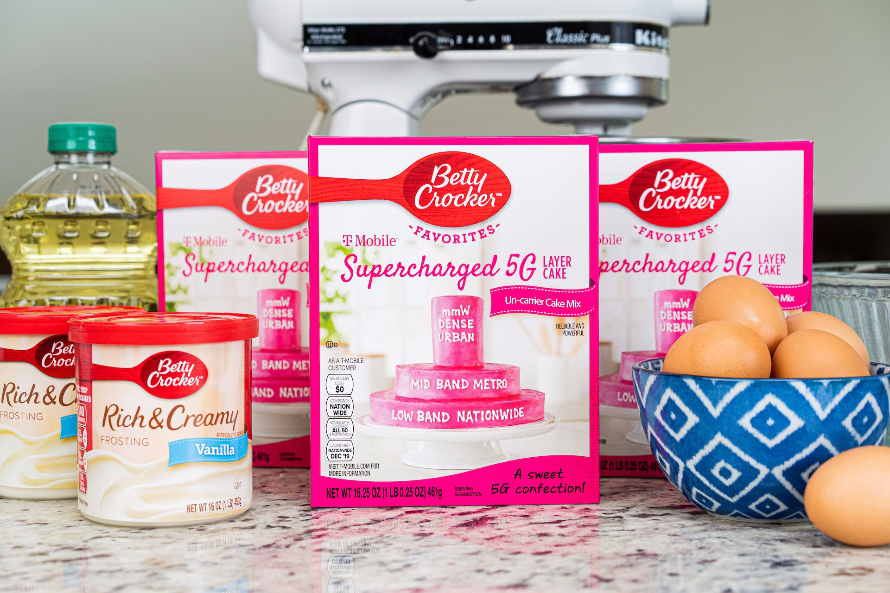

import { FactBox } from '@blog'
import TeX from '@matejmazur/react-katex'

<TableOfContents {...props} />

# Introduction

Rolling out a new layer of a mobile network has always required networks to think about how and when users should move between layers of the
network. In the early days of 4G, a legitimate case could be made that strong UMTS2100 (often dual-carrier) was better than overwhelming a
10&nbsp;MHz LTE800 carrier with inefficient users at the edge of a cell, both for the network and the user. As the network deployment matured,
greater focus was on keeping users on 4G to prevent disruption, knowing that the UMTS network was unlikely to offer a much better service.

Deploying 5G Standalone (SA) is a bit different. Not only do many users often have access to 5G already through 5G Non-Standalone (NSA), they
also often have access to the exact same spectrum being used for 5G SA FDD, because the deployment uses Dynamic Spectrum Sharing (DSS) between
the LTE and 5G layers[\[1\]](#note-1). Achieving a balance between the marketing demands to have 5G everywhere,
offloading users from pretty busy 4G networks and giving individual users the best possible experience (defined broadly as fast speeds &ndash;
however debatable that as a goal may be) is no easy challenge.

# 5G SA on Vodafone

With that in mind, we can turn our eye to the only commercial 5G SA network in Britain, Vodafone UK. It's fair to say that it's not particularly
widely used, requiring&hellip;

- a particular plan,
- you to have joined Vodafone since Feb 2023,
- a [specific, compatible device](https://www.vodafone.co.uk/network/5g#getting5g),
- be "in an area covered by our 5G Ultra network", as well as
- a huge pinch of luck to meet whichever secret requirements also exist.

It's enabled only on a subset of Vodafone's 5G network, basically only sites running Ericsson equipment where Vodafone is the 'host' (the
infamous network share causing issues once again). For those unfamiliar, Vodafone relies quite heavily outside of 'hot spot' areas on n1 DSS and
n8 DSS (the latter almost never being used for 5G NSA), the n78 coverage isn't quite as developed as that on competitors (the 64T64R-only
strategy at the beginning as well as a broader lack of scale does look to have impacted quite heavily here).

<figure>

<figcaption>
A very happy man, celebrating his ability to ["unlock the true power of digital"](https://www.vodafone.co.uk/newscentre/our-network/5g-standalone-unlocking-the-true-power-of-digital/)
with Vodafone 5G Ultra. Credit: [Vodafone Press Office](https://www.vodafone.co.uk/newscentre/press-release/launch-5g-ultra-uk-first-5g-standalone-network-for-consumers/)
</figcaption>
</figure>

The 'parameters' that control how a device moves between layers of a network (both between frequencies of the same technology and between
technologies) could be a whole blog article in itself, so I'll try and keep my explanation and thoughts as brief as possible.

The thoughts have been based mostly on travels around Vodafone's South East and London (SEAL) area, but some differences where observed have been
noted from Vodafone's South West and North (SWAN) network area.

It's clear that Vodafone is still 'testing and learning' with its SA deployment, a likely reason for it being fairly restricted in access. This
article isn't a criticism of a hard job; it's very much just a few thoughts on it all.

<FactBox title="Disclaimer">

As I don't have access to Vodafone's 5G standalone network, I can only base my comments on the broadcast parameters which are visible to all
users of the network.

Such parameters only define idle mode mobility (where the device itself dictates which cell it connects to) and not connected mode mobility
(where this is decided directly by the network).

</FactBox>

## The norm

Mobility parameters for selecting 5G SA from LTE are broadcast in the LTE System Information Block 24 (SIB24). If we look at the 'default' set up
(signalling below), we can see a fairly simple strategy:

- The 50&nbsp;MHz n78 carrier is prioritised _above LTE_ (`cellReselectionPriority: 6`), with a SS-RSRP threshold to move from LTE to NR of
  -96&nbsp;dBm (if the phone measures the carrier to be higher than that in signal strength then it'll have a go at trying to connect to NR SA)
- The other carriers (n1, n8, n78-C2) are prioritised _below_ all LTE carriers, meaning that the average user is unlikely to use them
  - While there are signal thresholds governing their use, they're not relevant in practice as you've exhausted all the LTE carriers by the time
    you start looking at these carriers, so it's exceedingly unlikely the thresholds will be met

<figure>
<pre>
  <code>
    {`
carrierFreqListNR-r15
  ...
  [1]
    carrierFreq-r15 : 628032
    multiBandInfoList-r15
      [0] : 78
    measTimingConfig-r15
      periodicityAndOffset-r15 -> sf20-r15 : 0
      ssb-Duration-r15 : sf1
    subcarrierSpacingSSB-r15 : kHz30`}
    
      {`
    cellReselectionPriority-r15 : 6
    cellReselectionSubPriority-r15 : oDot6
    threshX-High-r15 : 14
    threshX-Low-r15 : 14
    q-RxLevMin-r15 : -62`}
    
    {`
    p-MaxNR-r15 : 23
    deriveSSB-IndexFromCe11-r15 : false
  [2]
    carrierFreq-r15 : 428190
    multiBandInfoList-r15
      [0] : 1
    measTimingConfig-r15
      periodicityAndOffset-r15 -> sf20-r15 : 0
      ssb-Duration-r15 : sf1
    subcarrierSpacingSSB-r15 : kHz15`}
    
      {`
    cellReselectionPriority-r15 : 2
    cellReselectionSubPriority-r15 : oDot6
    threshX-High-r15 : 31
    threshX-Low-r15 : 31
    q-RxLevMin-r15 : -62`}
    
    {`
    p-MaxNR-r15 : 23
    deriveSSB-IndexFromCell-r15 : false`}
  </code>
</pre>

<figcaption>Extract from a Vodafone UK LTE SIB24 signalling data recorded with Network Signal Guru</figcaption>
</figure>

<FactBox title="Calculating thresholds">

If you look closely at the signalling above, you might notice that the reselection threshold isn't given anywhere in dBm. Instead, the device
must calculate the real threshold from the signalled values.

When reselecting to a cell with _higher_ priority, we apply the `threshX-High-r15` offset on top of `q-RxLevMin-r15`, but when reselecting to a
cell with _lower_ priority, we apply the `threshX-Low-r15` offset on top of `q-RxLevMin-r15`. To express the threshold in dBm, we just multiply
by two:

  <TeX math="(Q_{rxlevmin} + \text{Thresh}_{X}) \times 2 = \text{required RSRP}" />

 
Applying this in practice&hellip;

  <TeX math="(-62 + 14) \times 2 = -96\text{ dBm}" />

</FactBox>

## The exceptions

Other than this default, there can be quite a bit of variation. One variant of the SIB24 will let your phone give n78 SA a go at -106&nbsp;dBm
instead. Others are even more interesting. I'd like to highlight this one seen near Epsom railway station (Surrey) which contains _only n1_ as a
candidate for idle mode mobility reselection.

Note that this time **n1 is prioritised above LTE** (`cellReselectionPriority : 6`, while LTE typically uses 3-5) and the thresholds are very
different. If your phone were to receive this, it would attempt to connect with n1 SA if it were stronger than -120&nbsp;dBm.

<figure>
<pre>
  <code>
{`
carrierFreqListNR-r15
  [0]
    carrierFreq-r15 : 428190
    multiBandInfoList-r15
      [0] : 1
    measTimingConfig-r15
      periodicityAndOffset-r15 -> sf20-r15 : 1
      ssb-Duration-r15 : sf1
    subcarrierSpacingSSB-r15 : kHz15`}

{`
    cellReselectionPriority-r15 : 6
    threshX-High-r15 : 2
    threshX-Low-r15 : 0
    q-RxLevMin-r15 : -62`}

{`
    p-MaxNR-r15 : 33
    deriveSSB-IndexFromCell-r15 : false
t-ReselectionNR-r15 : 1`}
</code>
</pre>

<figcaption>Another Vodafone UK LTE SIB24 signalling data recorded with Network Signal Guru</figcaption>
</figure>

## The reality

A more realistic 'fully live' configuration has been spotted in a few places. The SIB24 I've personally seen in Crewe reflects what you'd expect
a mature SA to look like. Here n8, n1 and n78 are sequentially prioritised above the LTE carriers.

I find it helpful to visualise it as the spectrum 'layer cake' T-Mobile USA famously used to promote their network strategy. The thresholds are
different for each carrier: your phone will try and use n8 if it's stronger than -120&nbsp;dBm; n1 if it's stronger than -116&nbsp;dBm; and n78
if stronger than -108&nbsp;dBm.

This feels instinctively quite aggressive at getting users onto 5G SA, particularly for n8. There are other groups of parameters that can be
found, but I've tried to focus on the most common and the most interesting rather than creating a comprehensive (and boring) list &mdash; it's
fair to say this is still early days on finding the right combination!

<figure>

<figcaption>
A delicious-looking box of T-Mobile Betty Crocker cake mix. Mmmm&hellip; Credit: [T-Mobile USA Newsroom](https://www.t-mobile.com/news/network/t-mobile-betty-crocker-5g-layer-cake)
</figcaption>
</figure>

<figure>
<pre>
  <code>
    {`
carrierFreqListNR-r15
  [0]
    carrierFreq-r15 : 428190
    multiBandInfoList-r15
      [0] : 1
    measTimingConfig-r15
      periodicityAndOffset-r15 -> sf20-r15 : 0
      ssb-Duration-r15 : sf1
    subcarrierSpacingSSB-r15 : kHz15`}
    
      {`
    cellReselectionPriority-r15 : 6
    threshX-High-r15 : 4
    threshX-Low-r15 : 0
    q-RxLevMin-r15 : -62`}
    
    {`
    p-MaxNR-r15 : 33
    deriveSSB-IndexFromCe11-r15 : false
  [1]
    carrierFreq-r15 : 628032
    multiBandInfoList-r15
      [0] : 78
    measTimingConfig-r15
      periodicityAndOffset-r15 -> sf20-r15 : 0
      ssb-Duration-r15 : sf1
    subcarrierSpacingSSB-r15 : kHz30`}
    
      {`
    cellReselectionPriority-r15 : 7
    threshX-High-r15 : 8
    threshX-Low-r15 : 0
    q-RxLevMin-r15 : -62`}
    
    {`
    p-MaxNR-r15 : 33
    deriveSSB-IndexFromCe11-r15 : false
  [2]
    carrierFreq-r15 : 188450
    multiBandInfoList-r15
      [0] : 8
    measTimingConfig-r15
      periodicityAndOffset-r15 -> sf20-r15 : 1
      ssb-Duration-r15 : sf1
    subcarrierSpacingSSB-r15 : kHz15`}
    
      {`
    cellReselectionPriority-r15 : 5
    threshX-High-r15 : 2
    threshX-Low-r15 : 0
    q-RxLevMin-r15 : -62`}
    
    {`
    p-MaxNR-r15 : 33
    deriveSSB-IndexFromCell-r15 : false
t-ReselectionNR-r15 : 1`}
</code>
</pre>

<figcaption>Another Vodafone UK LTE SIB24 signalling data recorded with Network Signal Guru</figcaption>
</figure>

# The future

Although there's no one-size-fits-all strategy for deciding the right way to go around this, I think it's reasonably likely that Vodafone will
eventually coalesce around a default set of parameters similar to those found at Crewe, but there are good reasons why they may not want to do
that today. The most important factor &mdash; user experience &mdash; would probably be against using the Crewe parameter set network-wide today.

The SA layer cake is missing key tools that Vodafone uses to improve its network experience. There's no B20, no B32, no B7 and no B3 or B38.
These frequencies are often used to top up the speed, and moving a user to 5G SA means the speed could be lower on n8 DSS compared to the LTE
experience with heaps of carrier aggregation. n1 DSS could be added via CA, but this is a reasonably high load layer on the LTE side of things,
and only 15&nbsp;MHz. It's also not a given that n1 is present on a site with n8 and vice-versa.

This is the likely driving factor behind the default parameter set: get users off LTE onto n78 SA when it's strong enough to provide a high speed
without a huge amount of ping-pong between the two networks. I think there are some valid questions about whether -96&nbsp;dBm and -106&nbsp;dBm
are conservative values, but it also makes sense to take it slowly given LTE already provides a decent experience for most. I suspect we'll never
see n78 getting to quite the same low values (-120&nbsp;dBm) as we've seen n8 and n1, given its higher frequency and quite weak link budget for
upload, but we'll probably see some movement in that direction.

As the network matures, more frequencies get brought over to the NR side (either as NR only or DSS) and more sites get the full set of n8,n1,n78,
we'll probably see a greater shift to a more aggressive offload to SA. I'd hope we'd see the use of features vendors are developing to be smart
in connected mode about whether NSA or SA represents the best choice for a user and hopefully the use of my favourite (quality based
reselection - less important in a network with relatively low load). We may also see networks prioritise NR in scheduling over LTE when using
DSS, giving more of a reason to get users to SA. In the meantime, accept that Vodafone taking it slow is probably the best choice for your speed
tests, at least until 5G moves beyond being an 'eMBB'[\[2\]](#note-2) solution.

---

# Notes

[\[1\]](#note-1-link) Dynamic spectrum sharing (DSS) allows one carrier to be used for multiple radio access technologies
(RATs) at the same time. In this case, it can be used for LTE and NR simultaneously.

[\[2\]](#note-2-link) "enhanced mobile broadband"
