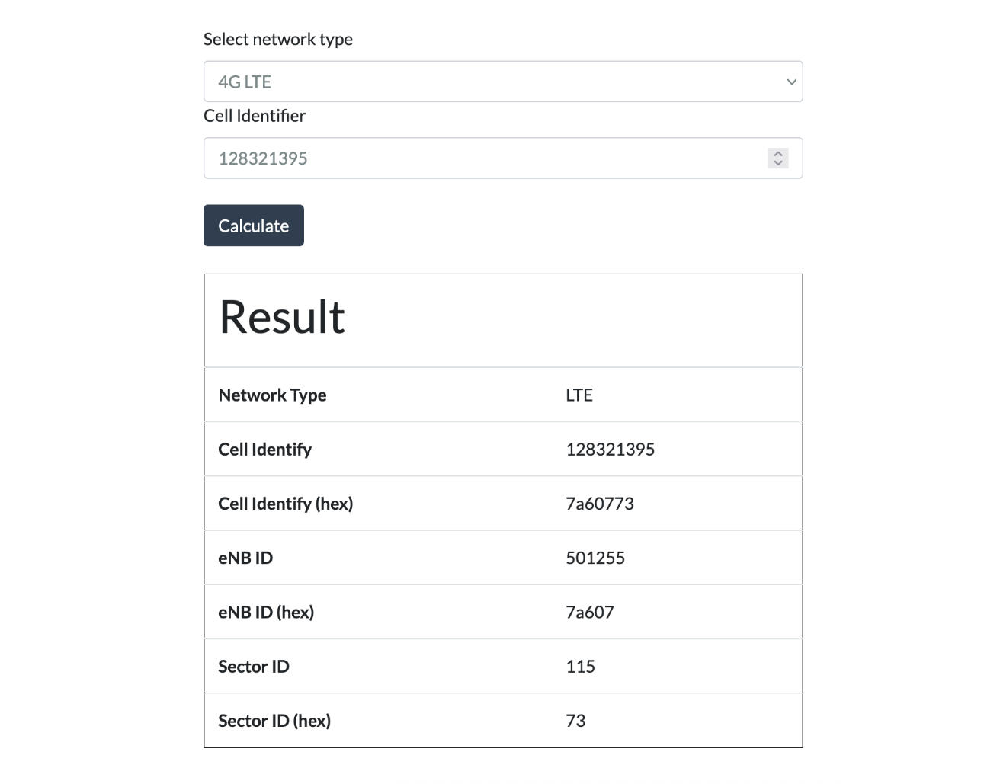
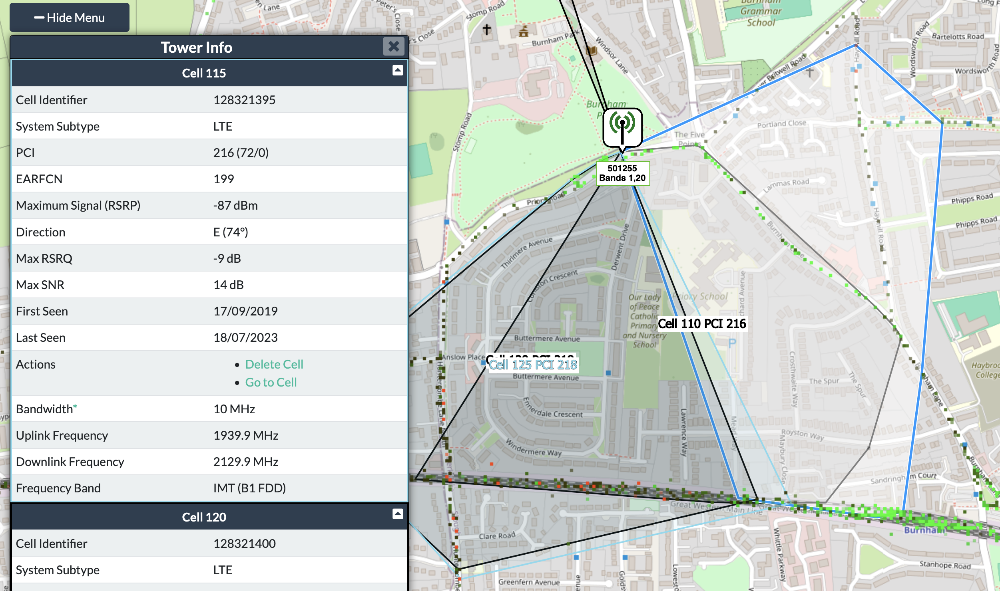
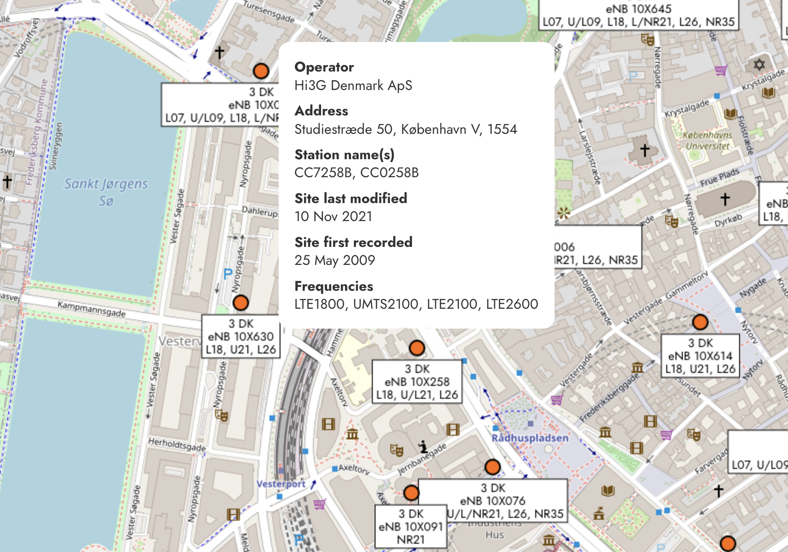

import { FactBox } from '@blog'

<TableOfContents {...props} />

<FactBox title="Update (19th May 2025, 08:14 BST)">

O2 reached out to me via email to confirm that this issue has been resolved. I have validated this information myself, and can confirm that the
vulnerability does appear to be resolved.

</FactBox>

# Introduction

Voice over LTE (VoLTE) is a way to make calls via an internet-based protocol on mobile networks using a standard called IP Multimedia Subsystem
(IMS). IMS implementations have historically caused trouble due to their increased complexity and device interdependence. This increase in
complexity has traditionally only externally manifested with device incompatibility problems. In the past, it wasn't uncommon to find devices
that required special firmware to utilise VoLTE and WiFi Calling.

However, I have always been interested in another risk to this increased complexity. **Security.**

With an IMS implementation, it is up to the mobile network to choose how they want to implement the services, and what configurations they want
to use. Your phone then talks directly with these servers. Mobile networks have a responsibility to ensure that these servers are kept up to date
and secure, and that their configurations do not lead to unnecessary data exposure.

Unfortunately, today we will be looking at a great example of a mobile network that has validated my concerns.

# O2 UK

On 27 March 2017, O2 UK launched their first IMS service.<sup id="note-1-link">[\[1\]](#note-1)</sup> Dubbed "4G Calling" by the network, it
provided improved voice quality and a better in-call data experience as customers did not drop down to 3G when making a call.

As someone who had recently moved to O2, I was interested in the network's IMS implementation, particularly which voice codecs were supported by
the network for calls made on 4G/WiFi Calling.

Using an application known as Network Signal Guru (NSG) on my rooted Google Pixel 8, I called another O2 customer (with a 4G VoLTE compatible
device) to try and determine audio quality.

A bug within NSG on modern Google Pixel devices with Samsung Modems means that the VoLTE section of the the app doesn't automatically populate
the codec used for the current call, meaning that I instead had to look at the raw IMS signalling messages sent between my device and the network
to find this out.

# Signalling messages

Quite quickly I realised something was wrong. The responses I got from the network were extremely detailed and long, and were unlike anything I
had seen before on other networks. The messages contained information such as the IMS/SIP server used by O2
([Mavenir UAG](https://www.mavenir.com/portfolio/mavcore/cloud-native-ims/)) along with version numbers, occasional error messages raised by the
C++ services processing the call information when something went wrong, and other debugging information. However, most notable were a set of five
headers near the bottom of the message:

<figure>

```
SIP Msg
...
  P-Mav-Extension-IMSI: 23410123456789
  P-Mav-Extension-IMSI: 23410987654321
  P-Mav-Extension-IMEI: 350266809828927
  P-Mav-Extension-IMEI: 350266806365261
  ...
  Cellular-Network-Info: 3GPP-E-UTRAN-FDD;utran-cell-id-3gpp=2341010037A60773;cell-info-age=26371
```

<figcaption>
Synthesised excerpt of IMS signalling message for demonstration; not a genuine IMEI/IMSI/cell ID.
</figcaption>
</figure>

Two sets of IMSIs, two sets of IMEIs, and a Cell ID header. How curious&hellip;

Sure enough, when comparing both the IMSIs and IMEIs in the message to those of my own devices, I had been given both the IMSI and IMEI of my
phone which initiated the call, **but also the call recipient's**.

Curious, I looked into the `Cellular-Network-Info` header. I had never seen this SIP header before but a quick bit of research led me to learn
how to decode it. The start of the value, `3GPP-E-UTRAN-FDD` indicates that the cell data is for 4G (officially known as E-UTRAN) FDD (frequency
division duplex). The folllowing section starting with `utran-cell-id-3gpp` is broken down into 3 parts:

<figure>


</figure>

- the first 5&ndash;6 digits are the network PLMN _of the recipient_
- the following 4 characters are the _recipient's_ Location Area Code (LAC) in hexadecimal
- the final 7 characters are the _recipient's_ Cell ID, again in hexadecimal

The final section represents how old the data is in seconds. This is present when the device isn't currently connected to a network, such as when
you have no signal or are relying on WiFi Calling.

That means for the above example, we are able to work out that the recipient:

- is currently connected to the O2 network (234-10)
- is within LAC 0x1003 (decimal: 4099) on Cell ID 0x7a60773 (decimal: 128321395)
- uses a Google Pixel 9 (IMEI: 350266806365261)
- has an O2 SIM (IMSI: 23410987654321)

**This is bad.**

With all this information, we can make use of publicly crowdsourced data, collected by tools such as [cellmapper.net](https://cellmapper.net), to
cross-reference this information to work out a general location of the user.

First, we just throw the Cell ID into a tool that calculates what site ID this corresponds to:

<figure>



<figcaption>

[Cellmapper's cell ID calculator](https://www.cellmapper.net/enbid?net=LTE&cellid=128321395)

</figcaption>
</figure>

Then we just have to search for that site on Cellmapper's map:

<figure>



<figcaption>

[O2 UK eNB 501255 on Cellmapper](https://www.cellmapper.net/map?MCC=234&MNC=10&type=LTE&latitude=51.52666039304819&longitude=-0.6526597015225719&zoom=16&showTowers=true&showIcons=true&showTowerLabels=true&clusterEnabled=true&tilesEnabled=true&showOrphans=false&showNoFrequencyOnly=false&showFrequencyOnly=false&showBandwidthOnly=false&DateFilterType=Last&showHex=false&showVerifiedOnly=false&showUnverifiedOnly=false&showLTECAOnly=false&showENDCOnly=false&showBand=0&showSectorColours=true&mapType=roadmap&darkMode=false&imperialUnits=false)

</figcaption>
</figure>

Here, you can see the macro cell the user was on at the time of the call. While this has a relatively sizeable coverage area, shown by the
selected polygon with the blue outline, dense urban areas will make use of very many sites (such as small cells, which are often fitted directly
to streetlamps) with small coverage areas. Each site in these areas can often cover areas as small as 100m<sup>2</sup>. In a city, this becomes
an _extremely_ accurate measure of location.

I also tested the attack with another O2 customer who was roaming abroad, and the attack worked perfectly with me being able to pinpoint them to
the city centre of Copenhagen, Denmark.

<figure>



<figcaption>Location of eNB 107258 on 3DK, near Vesterport St., Copenhagen</figcaption>

</figure>

I think it's important to note here that my device is **in no way special**. It's not doing anything odd to the network and hasn't behaved any
differently. All it is doing is allowing me to see the information being sent to it. This effectively means that every O2 device that is making a
phone call on IMS (4G Calling / WiFi Calling) is receiving information that can be used to trivially geolocate the recipient of the call.

# What I'd like to see change

O2 must remove the highlighted headers from all IMS / SIP messages to protect the privacy and safety of customers. It would be logical to also
disable debug headers, as I imagine a scenario where those unintentionally leak further information could occur. There is no reason for any
device outside of the network core to see those headers.

I'm extremely disappointed as an O2 customer to see a lack of any escalation route to report these kind of potential vectors for attack. EE, a
rival network, have a clear and well defined escalation route (see https://www.bt.com/about/contact-bt/responsible-disclosure) that I imagine
would have prevented the need for this information to have been publicly shared. I don't want to be the enemy, I simply want to feel comfortable
using my phone.

# Conclusion

Any O2 customer can be trivially located by an attacker with even a basic understanding of mobile networking.

Disabling 4G Calling **and** WiFi Calling **would** effectively prevent the location disclosure portion of this attack, as the
"Cellular-Network-Info" header is only sent when the recipient device responds. The disclosure of IMEI and IMSI **still occurs** irrespective of
IMS registration status, meaning disabling 4G Calling and WiFi calling has no effect on this data exposure.

Attempts were made to reach out to O2 via email (to both Lutz Schüler, CEO and securityincidents@virginmediao2.co.uk) on the 26 and 27 March 2025
reporting this behaviour and privacy risk, but I have yet to get any response or see any change in the behaviour.

---

# Notes

<sup id="note-1">[\[1\]](#note-1-link)</sup> https://www.engadget.com/2017-03-29-o2-wifi-4g-calling.html

Article edited by David Wheatley.

---

**Edit (18 May 2025, 23:40 UTC):** A previous version of this article stated the contacted email was securityincidents@virginmedia.co.uk. This
was incorrect, and the actual email contacted was securityincidents@virginmediao2.co.uk.

**Edit (27 May 2025, 22:21 UTC):** Originally, I stated that there was no way to mitigate the location disclosure part of this attack. With
further learning into the intricacies of IMS signalling, and the way in which devices send headers, I now believe that disabling both 4G Calling
and WiFi Calling **would** have mitigated this attack. I believe what I originally saw may have been due to rapid testing, and confusion between
different logged events. IMEI and IMSI disclosure was still present, even when the recipient device was unreachable.
